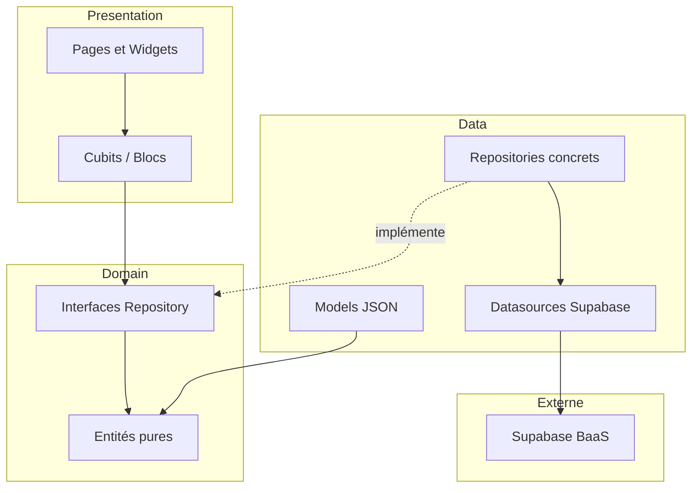
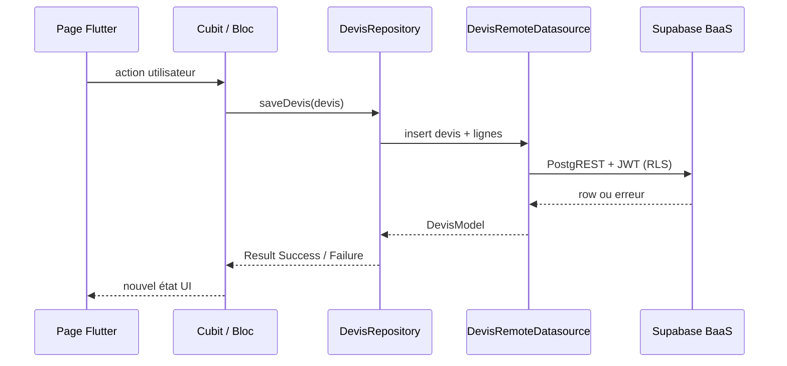
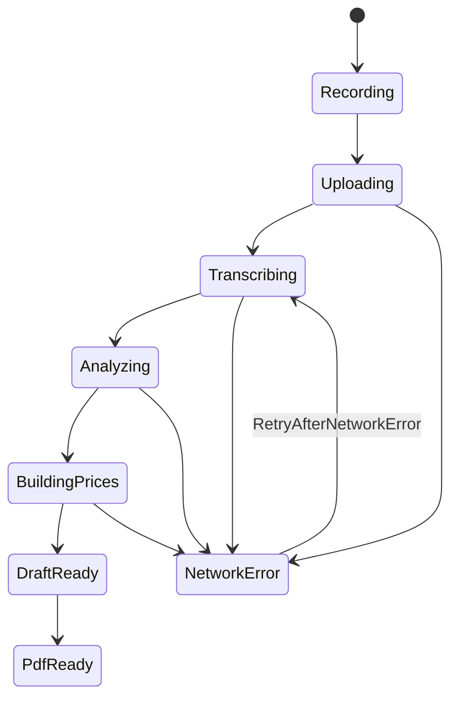

## Qu'est-ce que la Clean Architecture en Flutter ?

La **Clean Architecture** (Robert C. Martin) sépare le code en couches concentriques : la logique métier au centre, l'UI et l'infrastructure à la périphérie. Les dépendances pointent **toujours vers l'intérieur** : la couche domain ne connaît ni Flutter, ni Supabase, ni HTTP.

En Flutter, cela se traduit concrètement par :

| Principe | Application ArtDevis |
| --- | --- |
| **Indépendance du framework** | Les entités (`Devis`, `Client`, `Artisan`) sont des classes Dart pures |
| **Testabilité** | Repositories mockables, Bloc testable sans micro (`AudioRecorderWrapper`) |
| **Indépendance de l'UI** | Les Cubits/Blocs exposent des états ; les widgets ne font que les afficher |
| **Indépendance de la BDD** | `DevisRepository` est une interface ; Supabase ou mock derrière |
| **Règle de dépendance** | `presentation → domain ← data` (jamais l'inverse) |

### Variante retenue : feature-first

ArtDevis n'organise pas le code par couche globale (`/domain`, `/data`, `/ui` à la racine), mais **par feature métier** :

```
features/devis/
├── domain/       # Devis, LigneDevis, DevisRepository (interface)
├── data/         # DevisModel, SupabaseDevisRepository, MockDevisRepository
└── presentation/ # VoiceDevisBloc, pages, widgets
```

Chaque feature est **autonome** : un développeur peut travailler sur `clients/` sans parcourir tout le dépôt. Le dossier `core/` regroupe uniquement le transversal (router, thème, DI, logger, erreurs).



---

## Pourquoi ce choix pour ArtDevis ?

| Critère | Sans architecture claire | Avec Clean Architecture feature-first |
| --- | --- | --- |
| **Équipe petite, MVP évolutif** | Écrans qui appellent Supabase partout | Frontières nettes, refactoring par feature |
| **Backend BaaS** | Logique métier dispersée client/serveur | Domain centralise les règles côté Flutter |
| **Tests QA et CI** | Difficile sans réseau | `USE_MOCK=true` injecte des fakes |
| **Flux vocal complexe** | État spaghetti dans un `StatefulWidget` | `VoiceDevisBloc` machine à états explicite |
| **Multi-plateforme** | Code UI couplé aux plugins | Wrappers injectables (`PdfSharer`, `record`) |

La migration a suivi un plan en **5 étapes incrémentales** (socle `core/`, puis `auth`, `clients`, `equipe`, `devis`, purge legacy). L'objectif n'était pas la pureté théorique, mais un **MVP maintenable** avec une trajectoire Phase 2 claire (veille, admin repository, observabilité).

:::info Règle d'or
Aucune page n'appelle Supabase directement. Tout passe par un repository injecté (`sl<DevisRepository>()`) ou un Cubit/Bloc.
:::

Exception temporaire : l'écran admin conserve quelques appels directs (refactoring Phase 2).

---

## Pourquoi Flutter plutôt que React Native ?

Le choix Flutter date du cadrage MVP ArtDevis. Il repose sur des critères **produit et technique**, pas sur une préférence de langage.

| Critère | Flutter | React Native |
| --- | --- | --- |
| **Une codebase, 6 cibles** | Android, iOS, Web, Windows, macOS, Linux natifs | Mobile + web possible, écosystème fragmenté |
| **Rendu UI** | Moteur Skia, pixels identiques partout | Composants natifs, écarts visuels possibles |
| **Performance audio / PDF** | Plugins matures (`record`, `share_plus`) | Équivalent possible, bridge natif plus fragile |
| **Langage** | Dart (typé, null-safety, async/await) | TypeScript + bridge natif |
| **État et tests** | `flutter_bloc` + `bloc_test` standardisés | Redux, Zustand, MobX… choix multiples |
| **Déploiement web MVP** | `flutter build web` → Vercel (livré) | Expo web ou config Metro séparée |
| **Profil équipe** | Compétence Dart acquise sur le projet | Équivalent si équipe JS-first |

**Décision ArtDevis** : Flutter pour livrer **rapidement** une app terrain (dictée sur chantier) **et** une démo web (`artdevis.vercel.app`) depuis le **même code**, avec un écosystème BLoC adapté au flux vocal (machine à états).

React Native reste pertinent pour une équipe 100 % JavaScript ou une intégration forte avec des modules natifs existants. Ce n'était pas le cas au démarrage ArtDevis.

---

## Relation avec le BaaS (Supabase)

La Clean Architecture **ne remplace pas** le backend : elle **encapsule** l'accès au BaaS derrière des repositories.



| Couche | Rôle vis-à-vis du BaaS |
| --- | --- |
| **Domain** | Ignore Supabase. Définit `Result<T>`, entités, contrats repository |
| **Data** | Traduit JSON ↔ entités, appelle Auth/PostgreSQL/Storage/Edge Functions |
| **Presentation** | Affiche succès/erreur, jamais de `PostgrestException` brut |
| **core/di** | Injecte `SupabaseClient` ou mocks selon `USE_MOCK` |

Le BaaS gère **persistance, auth, RLS, fichiers, IA serveur**. Flutter gère **règles métier, UX, état local, calcul des totaux TTC** (jamais stockés en colonnes agrégées).

Voir aussi : [Stack, BaaS et modèle de données](./stack-et-backend).

---

## Stratégie de gestion d'état (State Management)

ArtDevis utilise **flutter_bloc** (package officiel de la communauté BLoC) avec une règle simple :

| Situation | Outil | Pourquoi |
| --- | --- | --- |
| Listes, formulaires, chargement simple | **Cubit** | Moins de boilerplate, méthodes directes (`load()`, `search()`) |
| Flux séquentiel avec retry et étapes IA | **Bloc** (events) | Historique d'événements, machine à états explicite |
| Session globale | **SessionCubit** | Fourni en racine dans `app.dart`, écoute Supabase Auth |

### Cartographie par feature

| Feature | Pattern | Portée |
| --- | --- | --- |
| Auth (session, login, signup) | Cubit | Session globale + formulaires |
| Clients, équipe, profil, chantiers | Cubit | Par page ou écran |
| Historique devis (fiche client) | Cubit | Local à la fiche |
| Devis vocal | **Bloc** | Machine à 7 events, 9+ états |
| Marketplace (prix web) | Cubit | Au clic sur une ligne |

### Flux vocal : pourquoi un Bloc et pas un Cubit ?

Le devis vocal enchaîne des étapes **asynchrones**, **ordonnées** et **réversibles partiellement** (retry réseau) :



Un **Cubit** aurait des méthodes `start()`, `retry()` difficiles à tracer. Un **Bloc** journalise chaque **event** (`StartRecording`, `StopRecording`, `EditLine`, `GeneratePdf`…), ce qui facilite les tests (`bloc_test`) et le debug.

Règle critique : toute erreur pipeline → état **`NetworkError`** + event `RetryAfterNetworkError`. **Jamais** de chargement infini.

### Injection et cycle de vie

| Composant | Enregistrement | Cycle de vie |
| --- | --- | --- |
| Repositories, `SessionCubit` | `get_it` (`sl`) | Singleton / lazy singleton |
| `ClientsListCubit`, `EquipeListCubit` | Créé par la page parente | Disposé avec la route |
| `VoiceDevisBloc` | Créé à l'ouverture de la dictée | Transmis via `BlocProvider.value` sur les 4 écrans du flux |

Navigation inter-écrans du flux vocal : **`Navigator.push`** (pas de routes go_router dédiées), pour garder le même Bloc vivant de l'Écran 3 à l'Écran 6.

---

## Pourquoi Cubit (et quand Bloc) ?

**Cubit** et **Bloc** viennent du même package (`flutter_bloc`). Un Cubit est un Bloc **sans events explicites** : on appelle une méthode, l'état change.

| Aspect | Cubit | Bloc |
| --- | --- | --- |
| API | `cubit.loadClients()` | `bloc.add(StopRecording())` |
| Traçabilité | Moins verbeux | Chaque transition = event nommé |
| Cas d'usage ArtDevis | 90 % des écrans | Flux vocal uniquement |
| Tests | `blocTest` sur le cubit | `blocTest` avec séquence d'events |

**Choix Cubit par défaut** : lisibilité pour une équipe produit/QA, moins de fichiers (`*_event.dart`) pour des écrans CRUD.

**Choix Bloc pour le vocal** : le PO et le support doivent pouvoir raisonner sur « à quelle étape le devis a bloqué » ; les events nommés servent de documentation vivante.

Alternatives **non retenues** :

| Alternative | Raison d'écart |
| --- | --- |
| **Provider seul** | Pas de machine à états structurée pour le vocal |
| **Riverpod** | Écosystème BLoC déjà documenté dans le projet, tests `bloc_test` en place |
| **setState partout** | Non testable, couplage UI/réseau |

---

## Stratégie de gestion des logs (Log Management)

Les logs ArtDevis suivent une **stratégie en trois niveaux**, alignée sur la séparation Clean Architecture / BaaS :

| Niveau | Couche | Outil | Statut |
| --- | --- | --- | --- |
| **1** | Repositories, Cubits, Bloc (Flutter) | `AppLogger` JSON | Livré |
| **2** | Edge Functions (serveur BaaS) | `_shared/log.ts` + dashboard Supabase | Livré (partiel) |
| **3** | Audit métier PostgreSQL | Table `evenements_devis` | Phase 2 |

### Niveau 1 : où logger dans l'architecture

| Couche | Logger ? | Exemple |
| --- | --- | --- |
| **Presentation (UI)** | Non (sauf debug temporaire) | Pas de `print()` dans les pages |
| **Cubit / Bloc** | Oui, erreurs métier | `VoiceDevisBloc` échec PDF |
| **Repository** | Oui, succès et échec | `AppLogger.failure` sur `generatePdf` |
| **Domain** | Non | Entités pures sans I/O |
| **Datasource** | Rare | Erreurs remontées au repository |

Format : une ligne JSON préfixée `[ArtDevis]`, **silencieux en release** (`kReleaseMode`) pour éviter les fuites d'IDs sur le terrain.

```json
{
  "level": "error",
  "feature": "devis",
  "action": "generatePdf",
  "message": "Devis introuvable",
  "context": { "devisId": "abc-123", "failureType": "ServerFailure" },
  "ts": "2026-08-19T22:29:07.027011"
}
```

Guide complet : [Logging et diagnostic (Niveaux 1 à 3)](/artdevis/exploitation/logging-et-diagnostic).

### Lien architecture ↔ diagnostic

| Symptôme | Couche à inspecter | Niveau log |
| --- | --- | --- |
| Bouton grisé, mauvais écran | Presentation / Cubit state | 1 (debug) |
| RLS, PDF, planification | Repository → Supabase | 1 + 2 |
| Whisper / GPT | Edge Function (hors Flutter) | 2 |
| Litige « qui a accepté le devis » | PostgreSQL audit | 3 (Phase 2) |

---

## Organisation du dossier `lib/`

```
lib/
├── main.dart                 # Bootstrap Supabase + get_it
├── app.dart                  # SessionCubit global + MaterialApp.router
├── core/
│   ├── config/               # Supabase, email devis, stratégie URL web
│   ├── di/injection.dart     # Enregistrement get_it
│   ├── error/                # Result<T>, AppFailure
│   ├── logging/              # AppLogger (Niveau 1)
│   ├── router/               # go_router + redirection session
│   └── widgets/              # Composants partagés (header, nav, logout)
└── features/
    ├── auth/                 # Session, login, signup
    ├── clients/              # Liste, fiche, historique
    ├── equipe/               # Membres rattachés au patron
    ├── devis/                # Flux vocal, historique, PDF
    ├── chantiers/            # Planning du jour
    ├── catalogue/            # Tarifs fournisseurs
    ├── veille/               # Coquille Phase 2
    ├── admin/                # Cockpit super-admin
    ├── home/                 # Shell de navigation
    └── profil/               # Paramètres artisan
```

## Pattern Repository et Result

Chaque accès données passe par une **interface** domain et retourne un **`Result<T>`** (Success / Failure) :

```dart
// domain — contrat pur
abstract class DevisRepository {
  Future<Result<Devis>> saveDevis(Devis devis);
  Future<Result<String>> generatePdf(String devisId);
}

// presentation — gestion UI
final result = await sl<DevisRepository>().generatePdf(id);
switch (result) {
  case Success(:final value): /* afficher PDF */;
  case Failure(:final failure): /* NetworkError ou snackbar */;
}
```

Les **Failures** typées (`NetworkFailure`, `ServerFailure`, `AuthFailure`) évitent de parser des exceptions Supabase dans les widgets.

## Bascule mock / production

```bash
flutter run --dart-define=USE_MOCK=true
```

Chaque repository possède **Supabase** + **Mock** (seeds, latence simulée). `configureDependencies(useMock: true)` bascule l'injection sans changer une ligne de presentation.

Cela permet :

* Développement UI sans backend déployé
* Tests widget et bloc sans `MissingPluginException`
* Démos commerciales offline

## Features migrées et coquilles

| Feature | Statut migration |
| --- | --- |
| auth, clients, equipe, devis, catalogue, chantiers | Terminée |
| subscription, disponibilités, marketplace | Terminée |
| veille | Coquille UI, Phase 2 |
| admin | Repository migré, polish Phase 2 |

## Règles métier critiques (devis)

* Totaux HT, TVA, TTC **recalculés** depuis les lignes (getters entité `Devis`)
* TVA **par ligne** (20 %, 10 % ou 5,5 %)
* L'IA **ne devine jamais** le client : sélection avant dictée
* Devis accepté/refusé **verrouillé** en lecture seule, avec « Remettre en brouillon »

## Tests

| Fichier | Couverture |
| --- | --- |
| `test/widget_test.dart` | Branding écran de connexion |
| `test/features/devis/voice_devis_bloc_test.dart` | Machine à états du flux vocal |
| Tests pages et cubits | Historique client, assistant, disponibilités |

Les abstractions **`AudioRecorderWrapper`** et **`PdfSharer`** permettent de tester le Bloc sans plugins natifs : illustration directe du bénéfice Clean Architecture (inversion de dépendance).

## Références

| Document | Contenu |
| --- | --- |
| [Stack, BaaS, IA et modèle de données](./stack-et-backend) | Backend, auth, pipeline IA |
| [Logging et diagnostic](/artdevis/exploitation/logging-et-diagnostic) | Inspection logs N1–N3 |
| [Développement et tests](/artdevis/exploitation/developpement-et-tests) | Commandes `flutter analyze`, `flutter test` |
| Dépôt ArtDevis `docs/ArtDevis_Flutter_Clean_Architecture.md` | Guide migration détaillé (historique) |
