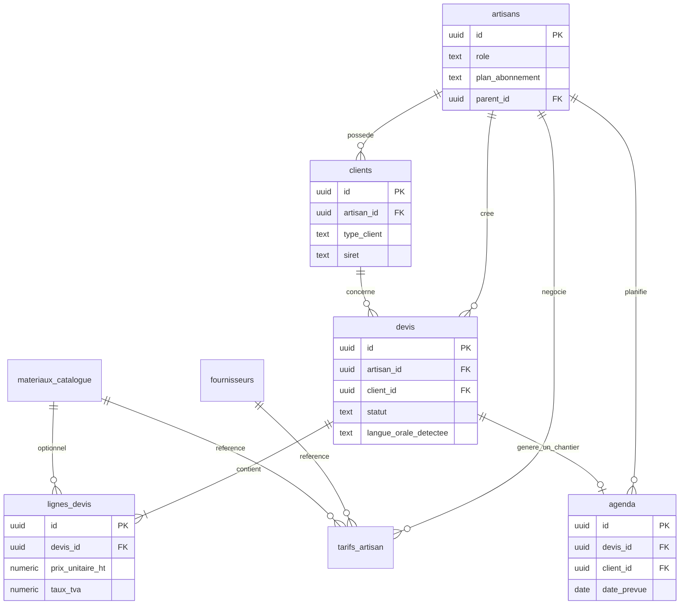
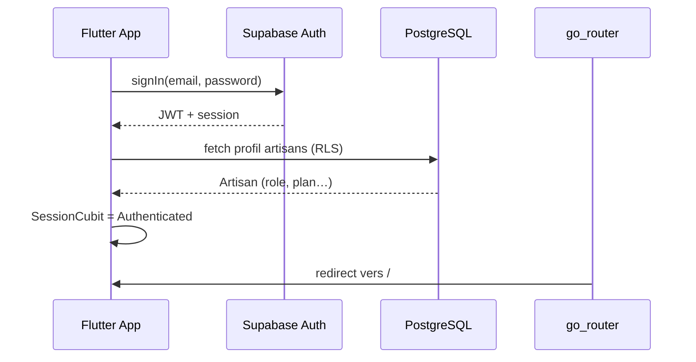
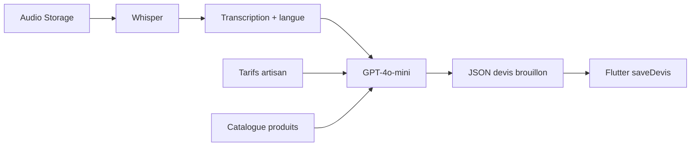

## Stack technique (vue d'ensemble)

| Composant | Technologie |
| --- | --- |
| Application | Flutter (Dart 3.12+), multiplateforme |
| État | flutter_bloc, equatable |
| Navigation | go_router |
| Injection | get_it |
| Backend | **Supabase** (BaaS) |
| IA | OpenAI (Whisper + GPT-4o-mini) via Edge Functions |
| Enregistrement audio | package `record` |
| Partage PDF | package `share_plus` |
| Déploiement web | Vercel |

---

## Supabase et le modèle BaaS

### Qu'est-ce qu'un BaaS ?

Un **BaaS** (Backend as a Service, backend en tant que service) est une plateforme cloud qui fournit **toute l'infrastructure serveur** sous forme de services managés : authentification, base de données, stockage de fichiers, fonctions serverless, parfois temps réel.

L'équipe produit **ne gère pas** de serveurs Linux, de clusters PostgreSQL, ni de load balancers. Elle consomme des **API** et des **SDK** (ici `supabase_flutter`).

### ArtDevis utilise Supabase comme BaaS

Supabase est une couche open source construite autour de **PostgreSQL**. Pour ArtDevis, il remplace un backend custom Node/Django que l'équipe aurait dû héberger et maintenir.

| Service Supabase | Usage ArtDevis |
| --- | --- |
| **Auth** | Connexion email/mot de passe, reset, invitation équipe |
| **PostgreSQL** | Données métier (artisans, clients, devis, agenda…) |
| **Row Level Security (RLS)** | Isolation multi-artisan (chaque patron ne voit que ses données) |
| **Storage** | Audio (`audio-devis`), PDF (`devis-pdf`, `factures-pdf`), logos, **photos chantier** (`photos-chantiers`, privé) |
| **Edge Functions** | Pipeline IA (`devis-vocal`), PDF, email, traduction |
| **Realtime** | Non utilisé en MVP (liste clients en `getClients()` simple) |

Projet : `https://jmokgfcucyygmhmmhoxn.supabase.co`

### Avantages du BaaS pour ArtDevis (MVP)

| Avantage | Impact |
| --- | --- |
| **Time-to-market** | Auth + BDD + Storage opérationnels en jours, pas en mois |
| **Coût initial faible** | Pas de DevOps dédié au démarrage |
| **PostgreSQL standard** | SQL, migrations versionnées, requêtes support |
| **RLS natif** | Sécurité multi-tenant sans middleware custom |
| **Edge Functions** | Logique IA et PDF près de l'API, secrets côté serveur |
| **SDK Flutter officiel** | Intégration mobile/web homogène |

### Inconvénients et limites

| Inconvénient | Mitigation ArtDevis |
| --- | --- |
| **Vendor lock-in partiel** | PostgreSQL exportable ; Edge Functions en Deno/TS |
| **Peu de logique métier centralisée côté Flutter** | Repositories + Clean Architecture |
| **Cold start Edge Functions** | Acceptable pour devis vocal (appel ponctuel) |
| **Observabilité limitée en gratuit** | Logger Niveau 1 livré ; Sentry Phase 2 |
| **Pas de file d'attente native** | Pipeline vocal synchrone (Whisper + GPT en chaîne) |
| **Clés anon en dur (MVP)** | Migration `--dart-define` prévue |

### Possibilités offertes (utilisées et futures)

| Possibilité | Statut ArtDevis |
| --- | --- |
| Auth JWT + refresh | Livré |
| RLS par `artisan_id` | Livré |
| Storage buckets privés/publics | Livré |
| Edge Functions + secrets | Livré |
| pgvector / recherche sémantique | Phase 2 (matching catalogue V1 sans vecteurs) |
| Realtime subscriptions | Phase 2 |
| Table d'audit `evenements_devis` | Phase 2 (voir [Logging Niveau 3](/artdevis/exploitation/logging-et-diagnostic)) |
| Stripe via Edge Function | Phase 2 (plans simulés en MVP) |

---

## Modèle relationnel des données (PostgreSQL)

ArtDevis repose sur un **schéma relationnel** classique. Les totaux de devis (HT, TVA, TTC) sont **calculés côté application** à partir des lignes, pas stockés en colonnes agrégées.

### Diagramme entité-relation (simplifié)



### Tables principales

| Table | Rôle | Clé d'isolation |
| --- | --- | --- |
| `artisans` | Profils, rôles, plan, acompte, IBAN | `id` = utilisateur Auth |
| `clients` | Carnet client | `artisan_id` |
| `devis` | En-tête devis, statut, langue, urgence | `artisan_id` |
| `lignes_devis` | Matériel et main d'œuvre, TVA par ligne | via `devis_id` |
| `agenda` | Chantiers planifiés (1 max par devis) | via `artisan_id` (RLS) |
| `fournisseurs` | Référentiel global (seeds) | lecture seule |
| `materiaux_catalogue` | Produits prédéfinis (seeds) | lecture seule |
| `tarifs_artisan` | Prix négociés privés | `artisan_id` (RLS) |
| `propositions_prix_web` | Comparaisons web | Phase 2 |

### Relations métier importantes

* Un **patron** (`role = owner`) possède des **clients** et des **devis**
* Un **opérateur** (`role = operateur`) est rattaché via `parent_id` au patron
* Un **devis accepté** peut créer **une entrée agenda** (chantier du jour)
* Les **tarifs** lient un artisan à un `(produit, fournisseur)` unique

---

## Stratégie d'authentification et de session

### Principe

L'authentification est déléguée à **Supabase Auth**. L'application Flutter ne stocke pas de mot de passe en local : elle reçoit un **JWT** (JSON Web Token) que le SDK renouvelle automatiquement.

### Flux de connexion



### Routes et garde de navigation

| Route | Accès | Rôle |
| --- | --- | --- |
| `/login` | Public | Connexion |
| `/reset-password` | Public (lien email) | Nouveau mot de passe |
| `/accept-invite` | Public (lien invitation) | Activation opérateur |
| `/` | Authentifié | Shell principal (Clients, Chantiers, Veille) |
| `/tarifs`, `/disponibilites` | Authentifié + plan Pro | Fonctionnalités gated |

Implémentation : `SessionCubit` global écoute `authStateChanges`. `go_router` redirige vers `/login` si `SessionUnauthenticated`.

### Inscription patron

* Formulaire : entreprise, **SIRET 14 chiffres**, email, mot de passe
* Création Auth + ligne `artisans` avec `role = owner`, `plan_abonnement = essai`
* Retour à l'écran de connexion (pas de wizard post-inscription)

### Sécurité des données (RLS)

Chaque requête Flutter passe le JWT. PostgreSQL applique les **policies RLS** : un artisan ne peut lire/écrire que les lignes où `artisan_id = auth.uid()` (ou règles équipe/admin documentées en migrations).

:::warning Points d'attention MVP
* Clés Supabase anonymes encore en dur dans le client
* Écran admin : appels Supabase directs (refactoring Phase 2)
* Identifiants de test pré-remplis sur `LoginPage` en développement
:::

---

## Pipeline IA du devis vocal

Le flux `devis-vocal` **ne persiste rien en base** : il retourne un JSON que Flutter enregistre via `DevisRepository.saveDevis`.

### Schéma du pipeline



### RAG et contexte injecté (V1, sans pgvector)

ArtDevis n'utilise **pas encore** de base vectorielle (pgvector). Le principe proche du **RAG** (Retrieval Augmented Generation) est appliqué ainsi :

| Étape | Mécanisme | Source |
| --- | --- | --- |
| **Retrieval** | Chargement SQL des tarifs négociés (20 max) et du catalogue (~40 produits) | `tarifs_artisan`, `materiaux_catalogue` |
| **Augmentation** | Injection dans le prompt système GPT | `formatTarifsForPrompt`, `formatCatalogueForPrompt` |
| **Generation** | GPT produit le JSON devis en s'appuyant sur ce contexte | `structureDevisFromTranscription` |

Phase 2 prévue : **pgvector** pour un matching produit plus robuste que le reranking sémantique purement LLM.

### Constrained decoding (sortie JSON stricte)

OpenAI est appelé avec `response_format: { type: "json_schema", json_schema: DEVIS_JSON_SCHEMA }` et `strict: true`.

Effet : le modèle est **contraint token par token** à produire un JSON conforme au schéma (lignes, TVA, types de ligne, urgence). Cela limite les réponses libres, le markdown parasite et les champs inventés.

Post-traitement serveur : `sanitizeGptPayload` force TVA ∈ {20, 10, 5.5}, quantités positives, types de ligne valides.

### Re-ranking sémantique (V1)

Sans moteur de recherche dédié, le **re-ranking** est confié au prompt GPT (étape interne 2) :

* Comparer chaque matériel dicté à la liste catalogue
* Choisir le produit le plus proche sémantiquement (« ballon Thermor 200 » → « Chauffe-eau électrique 200L »)
* Appliquer le tarif négocié si le produit matché figure dans les tarifs B2B

### Nettoyage de la dictée (query rewriting)

Whisper retourne la dictée **brute** (hésitations, répétitions). Le prompt système demande à GPT une **étape interne de nettoyage** :

* Supprimer « euh », faux départs, répétitions
* Conserver quantités, marques, urgence, nature des travaux
* Ne pas exposer le texte nettoyé dans la réponse (uniquement le JSON structuré)

La **traduction vers le français client** est une étape **ultérieure** (Edge Function `traduire-devis-client`), après relecture artisan.

### Paramètres de fiabilité

| Paramètre | Valeur | Rôle |
| --- | --- | --- |
| `temperature` | 0.1 | Réduire l'hallucination |
| `json_schema strict` | activé | Contraindre la structure |
| Tarifs B2B | priorité absolue | Prix négociés si match produit |
| Fallback tarifs | prix marché | Jamais bloquant |

---

## Edge Functions

| Fonction | Rôle |
| --- | --- |
| `devis-vocal` | Whisper + GPT + injection catalogue/tarifs |
| `generer-pdf-devis` | PDF + upload bucket `devis-pdf` |
| `envoyer-devis-email` | Resend + statut `envoye` (optionnel prod) |
| `traduire-devis-client` | Traduction brouillon → français |
| `invite-membre` | Invitation opérateur |

## Storage

| Bucket | Contenu |
| --- | --- |
| `audio-devis` | Fichiers audio de dictée |
| `devis-pdf` | PDF générés (`{artisanId}/{devisId}.pdf`) |
| `photos-chantiers` | Photos techniques internes (max 2 / devis, **privé**, hors PDF) |

## Statuts devis

| Statut | Signification |
| --- | --- |
| `brouillon` | En cours de rédaction |
| `envoye` | Transmis au client, `date_envoi` renseignée |
| `accepte` | Validé, déclenche planification chantier |
| `refuse` | Refusé par l'artisan |

## Migrations

Scripts dans `supabase/migrations/` du dépôt ArtDevis :

```bash
supabase link --project-ref jmokgfcucyygmhmmhoxn
supabase db push
```

Migrations notables : catalogue/tarifs, agenda chantiers, corrections varchar/grants admin.

## Diagnostic et logs

Pour inspecter les erreurs client, Edge Functions et (Phase 2) audit métier :

**[Guide visuel d'inspection des logs](/artdevis/exploitation/logging-et-diagnostic)**
