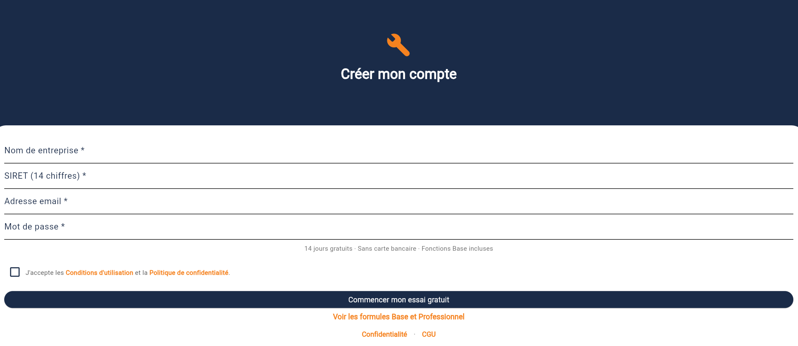
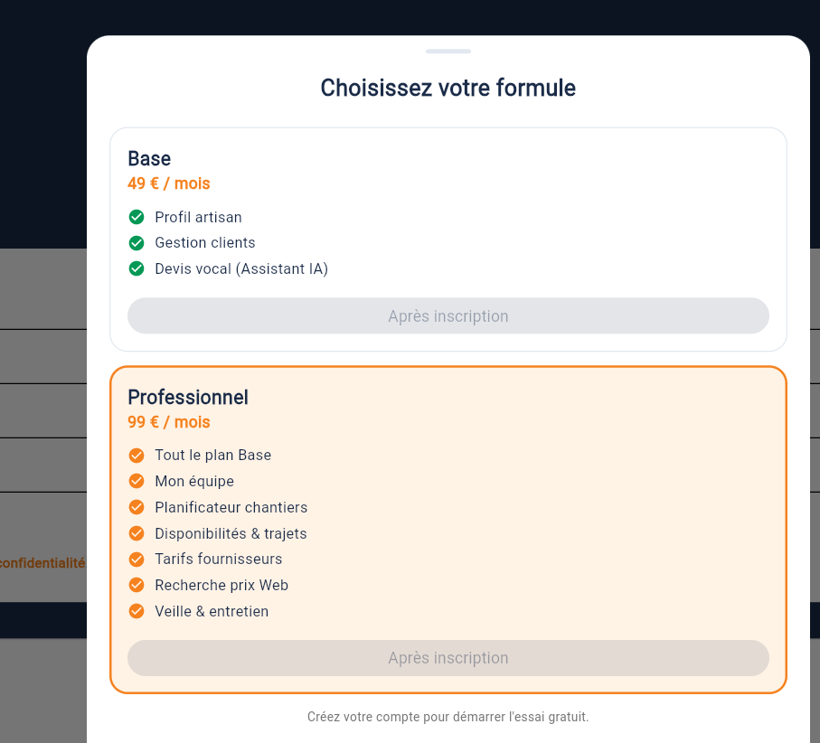
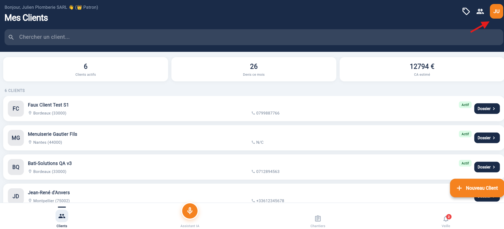
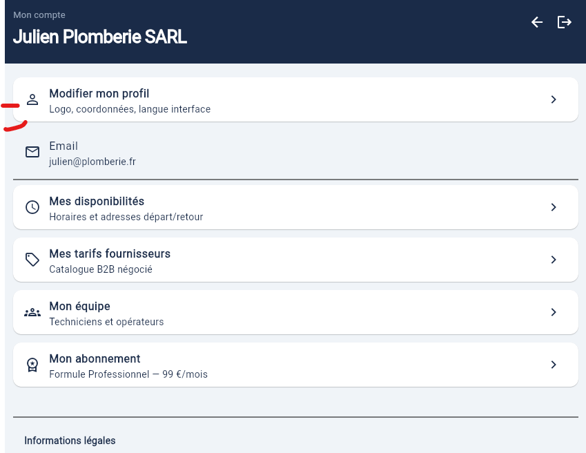
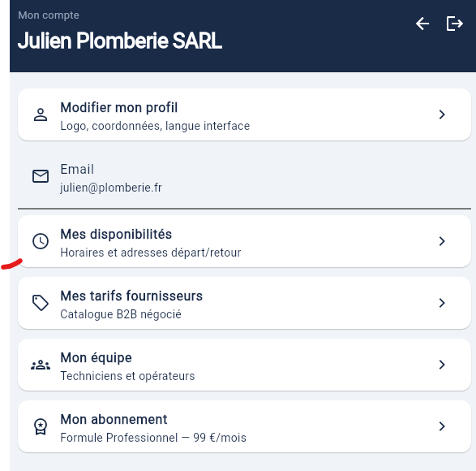
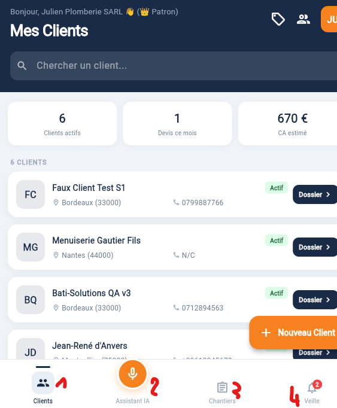

## Accéder à ArtDevis

| Support | Accès |
| --- | --- |
| **Web** | [artdevis.vercel.app](https://artdevis.vercel.app) |
| **Mobile** | Application ArtDevis (Android / iOS) |

---

## Créer un compte (patron artisan)

1. Ouvrir l'écran **Connexion**
2. Appuyer sur **Créer un compte**
3. Remplir le formulaire :

| Champ | Règle |
| --- | --- |
| Nom de l'entreprise | Obligatoire |
| SIRET | **14 chiffres** (identifiant de votre établissement en France) |
| Email | Votre adresse professionnelle |
| Mot de passe | Minimum 6 caractères |

4. Cocher **J'accepte les Conditions d'utilisation et la Politique de confidentialité**
5. Appuyer sur **Commencer mon essai gratuit**

:::tip Essai gratuit
L'inscription démarre en **Essai gratuit** (14 jours par défaut), **sans carte bancaire**. Vous pouvez créer des clients et des devis vocaux dès la première connexion.
:::

:::info Liens légaux
Les textes sont accessibles depuis l'écran Connexion ou Inscription, et plus tard dans **Profil → Informations légales**.
:::

---

## Se connecter

Saisissez l'email et le mot de passe choisis à l'inscription.

Mot de passe oublié : **Mot de passe oublié ?** sur l'écran Connexion → lien reçu par email.

---

## Les formules (Essai, Base, Professionnel)

| Formule | Ce que vous pouvez faire |
| --- | --- |
| **Essai gratuit** | Clients, devis vocal, profil |
| **Base** | Même périmètre après l'essai |
| **Professionnel** | + Mon équipe, Mes Chantiers, tarifs fournisseurs, veille |

Pour comparer les formules : lien **Voir les formules Base et Professionnel** à l'inscription (web et Android). Sur **iPhone/iPad**, les prix ne s'affichent pas dans l'app — contactez le support pour changer de formule.

Consulter ou simuler votre formule : **Profil → Mon abonnement**.

---

## Compléter votre profil

Après la première connexion :

1. Onglet **Clients** → icône **Profil** (en haut)
2. 
3. **Modifier mon profil** : logo, téléphone, adresse, IBAN, langue
4. 
5. **Mes disponibilités** : horaires et adresses de départ (formule Pro)

Un profil complet améliore vos PDF de devis et factures.

---

## Navigation principale

| Onglet | Rôle |
| --- | --- |
| **Clients** | Liste, fiches, devis vocal |
| **Assistant** | Raccourci devis vocal avec choix du client |
| **Chantiers** | Planning du jour (formule Pro) |
| **Veille** | Rappels entretien (MVP) |

Le bouton **+** en bas à droite permet d'**ajouter un client** depuis l'accueil.

---

## Suite recommandée

1. [Clients et devis vocal](/artdevis/guide-utilisateur/clients-et-devis-vocal)
2. [Envoyer un devis au client](/artdevis/guide-utilisateur/envoyer-au-client)
