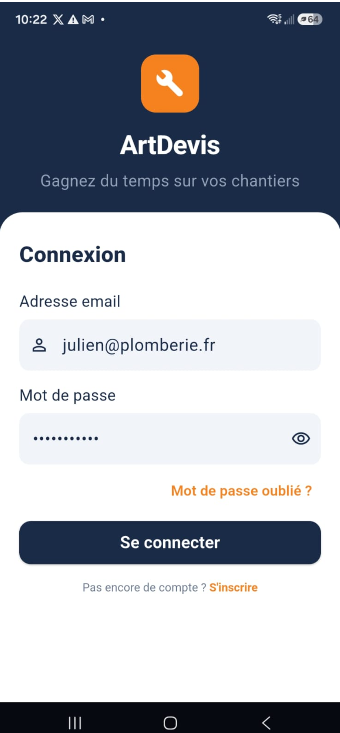

## Présentation générale

**ArtDevis** est une application métier multiplateforme Developper avec (Flutter) destinée aux artisans du bâtiment, en particulier les plombiers. Elle permet de **dicter un devis sur le chantier**, de le contrôler, de le traduire en français pour le client, puis de générer un **PDF professionnel** prêt à partager.

Le client final **n'utilise pas l'application**. Toute la relation commerciale passe par le PDF, le téléphone, WhatsApp ou l'email, selon les habitudes de l'artisan.

### Les trois piliers produit

| Pilier | Apport |
| --- | --- |
| **Gain de temps** | Un devis structuré en quelques minutes au lieu d'une rédaction manuelle longue |
| **Marge** | Intégration des tarifs fournisseurs négociés dans le devis vocal |
| **Inclusion** | L'artisan dicte dans sa langue, le client reçoit un document en français |

### Périmètre MVP livré (août 2026)

| Module | Statut | Commentaire |
| --- | --- | --- |
| Authentification et profil artisan | Livré | Connexion Supabase, onboarding, paramètres acompte |
| Clients | Livré | Liste, recherche, fiche client, historique devis |
| Devis vocal | Livré | Flux complet Écrans 3 à 6, mock et production |
| Flux devis France | Livré | Contrôle langue dictée, traduction FR, aperçu client |
| Relation client | Livré | Partage PDF, marquer envoyé, accepté/refusé |
| Mes Chantiers | Livré | Planification auto à l'acceptation, planning du jour |
| Mon Équipe | Livré | Gestion des opérateurs rattachés au patron |
| Catalogue fournisseurs | Livré | Tarifs privés par artisan, injection IA |
| Veille et entretien | Coquille | Interface démo, logique métier en Phase 2 |
| Facturation | Phase 2 | Non implémentée |

## Interface

### Environnements

| Environnement | URL ou accès |
| --- | --- |
| Application web (production) | [artdevis.vercel.app](https://artdevis.vercel.app) |
| Backend | Supabase (PostgreSQL, Auth, Storage, Edge Functions) |
| Démo mock | `USE_MOCK=true` sans appel réseau |

### Sommaire de cette section

**Présentation**
* [Vue d'ensemble](./presentation/vue-ensemble)

**Architecture**
* [Clean Architecture](./architecture/clean-architecture)
* [Stack et backend Supabase](./architecture/stack-et-backend)

**Fonctionnel**
* [Flux devis France](./fonctionnel/flux-devis-france)
* [Devis vocal](./fonctionnel/devis-vocal)
* [Relation client](./fonctionnel/relation-client)
* [Chantiers et veille](./fonctionnel/chantiers-et-veille)
* [Catalogue et tarifs fournisseurs](./fonctionnel/catalogue-fournisseurs)

**Exploitation**
* [Développement et tests](./exploitation/developpement-et-tests)
* [Guide QA](./exploitation/guide-qa)
* [Logging et diagnostic](./exploitation/logging-et-diagnostic)
* [Déploiement](./exploitation/deploiement)

**Roadmap**
* [État des livraisons](./roadmap/etat-des-livraisons)
