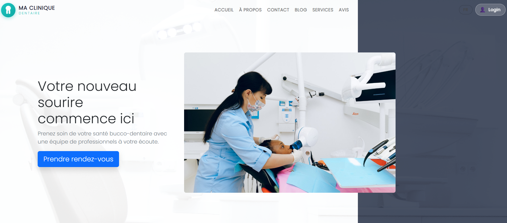

# Cabineris — Documentation fonctionnelle et technique

Documentation de référence pour **Cabineris** (repo `SudSoft-Doctor-Appointment`), application
de gestion de cabinet dentaire : site vitrine avec prise de rendez-vous en ligne pour les
patients, et tableau de bord interne pour le personnel de la clinique (dentistes,
réceptionnistes, administrateurs).



## À qui s'adresse cette documentation

Cette documentation est écrite pour être consommée par des **agents IA de développement**
(Claude Code ou équivalent) et par toute nouvelle personne rejoignant le projet. Elle sert de
socle de contexte avant toute génération de code : lire `Business` et `Functional`
avant de toucher au domaine, lire `Architecture` avant de créer un nouveau module backend,
lire `Database` avant toute modification du schéma Prisma.

## Contexte projet à connaître avant de contribuer

- **Deux applications coexistent** : une vitrine publique legacy (`src/` React 17 + `api/`
  Express/MongoDB) et une nouvelle plateforme clinique (`client/` React 18 + `server/`
  Express/PostgreSQL/Prisma). La nouvelle plateforme est la cible ; le legacy reste
  fonctionnel mais **ne doit plus être enrichi** (voir `Architecture/architecture.md`).
- **Projet en cours de construction** : seul le module d'authentification du nouveau backend
  est implémenté à ce jour. Tous les autres modules (patients, rendez-vous, dossiers
  médicaux, facturation…) sont modélisés dans le schéma Prisma mais pas encore développés.
  La distinction ✅ implémenté / 🟡 spécifié est donc essentielle dans toute cette
  documentation.
- **Ambition multi-clinique** : le schéma de données est conçu multi-tenant dès le départ
  (table `Clinic`, `clinicId` sur toutes les entités métier) pour pouvoir vendre le logiciel
  à plusieurs cabinets. Ne pas casser cette propriété.

## Légende des statuts utilisée dans tous les documents

| Statut | Signification |
|---|---|
| ✅ Confirmé | Extrait du code réel (schéma Prisma, package.json, structure des dossiers) ou des docs du repo |
| 🟡 Proposé | Recommandation issue d'ANALYSE.MD, non encore implémentée — à valider avant implémentation |
| 🔴 Lacune | Information absente des sources disponibles — nécessite une décision ou un complément métier |

## Sources documentaires utilisées pour produire cette documentation

| Document | Emplacement (repo source) | Contenu |
|---|---|---|
| `ANALYSE.MD` | racine | Analyse fonctionnelle : menus par rôle, modules applicatifs, recommandations UX |
| `ARCHITECTURE.md` | racine | Vue d'ensemble des deux applications, responsabilités, commandes, modules à construire |
| `FONCT.MD` | racine | Guide de démarrage : prérequis, ports, comptes de test, endpoints auth |
| `README.md` | racine | Présentation du projet d'origine (MERN), comptes seed |
| `server/prisma/schema.prisma` | server/prisma | Schéma de données réel (17 modèles, 6 enums) — source de vérité du domaine |
| `server/src/modules/` | server/src | Structure modulaire réelle du backend (15 modules) |
| `.github/workflows/` | racine | Pipelines CI/CD Azure (backend + frontend) |

## Structure du dossier

```
cabineris/
├── Business/       → Pourquoi ce logiciel existe, qui l'utilise, quelles règles le gouvernent
├── Functional/     → Ce que le logiciel fait, espace par espace (vitrine, patient, staff, admin)
├── Domain/         → Modèle de domaine (rôles, cycle de vie des entités, bounded contexts)
├── Architecture/   → Comment le logiciel est construit techniquement
├── Database/       → Le schéma de données réel (Prisma/PostgreSQL)
├── Frontend/       → Les deux applications clientes (vitrine legacy, dashboard clinique)
└── DevOps/         → Environnements, comptes de test, CI/CD
```

## Principe directeur pour toute contribution (humaine ou IA)

> Une seule plateforme cible : le couple `server/` + `client/`. Le legacy MongoDB/CRA
> (`api/` + `src/`) est en maintenance uniquement. Toute nouvelle fonctionnalité se code
> dans le nouveau backend modulaire Express/Prisma, en respectant le multi-tenant
> (`clinicId` obligatoire) et le filtrage par rôle. Préférer le CRUD simple et le module
> cohérent à toute sur-ingénierie : le projet est maintenu avec des ressources très limitées.
