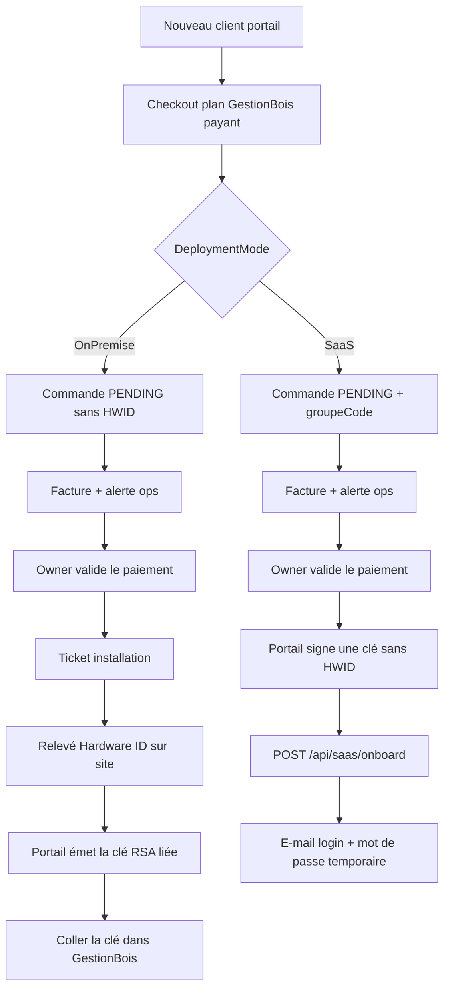
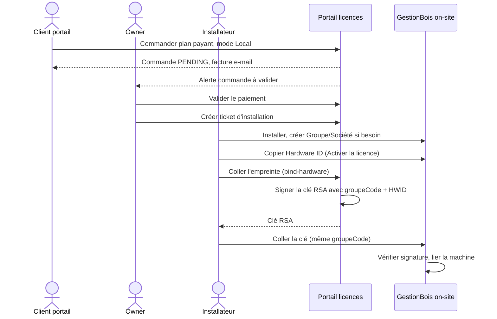
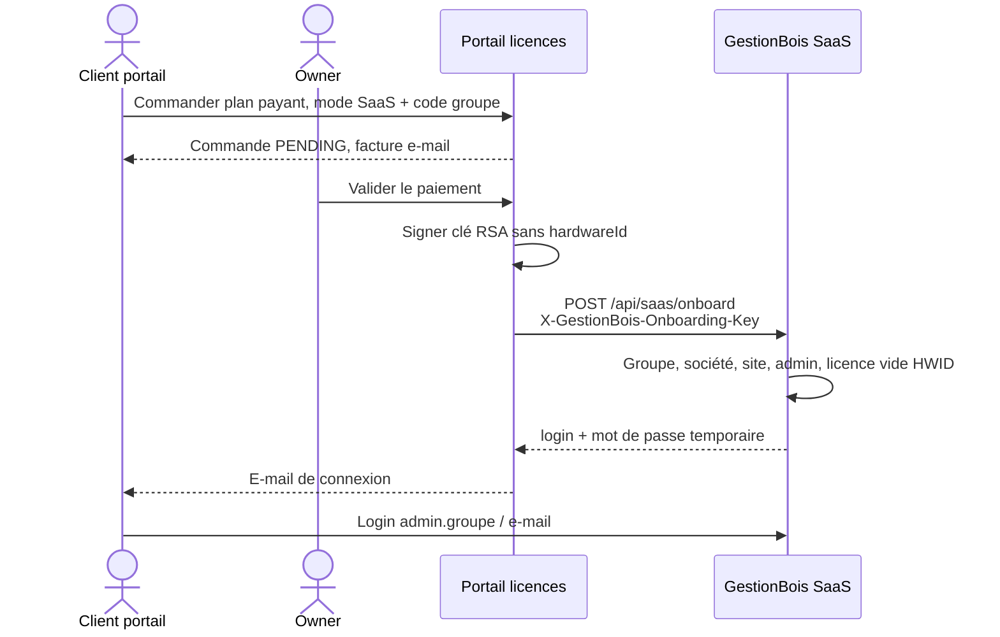
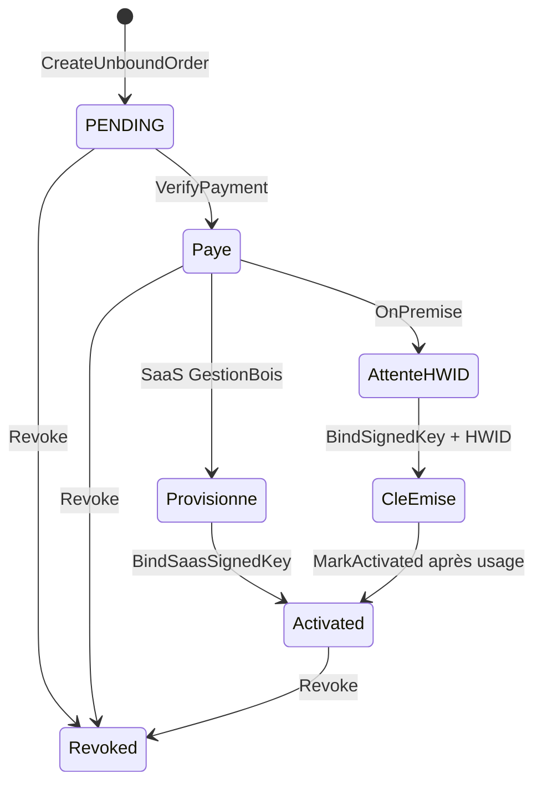

# Onboarding GestionBois — nouveau client on-site ou SaaS

## Statut : ✅ Confirmé (implémenté septembre 2026)

Documentation de référence des **deux parcours d’un nouveau client GestionBois** : installation **sur site** (on-premise) et **SaaS en ligne**. La clé privée RSA reste sur le **portail licences**. SysFact SaaS n’est pas dans cette tranche.

Sources code : `GestionBois` (`POST /api/saas/onboard`), `LicenseManagementApi` (`ONBOARDING.MD`), checkout portail (`DeploymentMode`).

## Vue d’ensemble

| | **Local (on-premise)** | **SaaS (en ligne)** |
|---|---|---|
| Choix checkout | Local | SaaS + code groupe |
| Empreinte machine (HWID) | Obligatoire **après** pose | Jamais |
| Colle de clé RSA | Oui, dans GestionBois | Non |
| Création groupe / société / admin | Par l’installateur (ou bootstrap) puis activation | Automatique après paiement validé |
| Association achat ↔ instance | Même `groupeCode` + clé collée | Appel serveur-à-serveur |
| Ticket déplacement | Oui, après paiement licence | Non |

La démo gratuite (`GB_DEMO`) reste un cas à part : empreinte **avant** émission de la clé.

## Acteurs

| Acteur | Rôle |
|---|---|
| Client (Company) | S’inscrit sur le portail, commande, reçoit facture / identifiants |
| Owner (ops portail) | Vérifie le paiement, crée le ticket on-prem si besoin |
| Installateur / partenaire | Pose le serveur, relève le Hardware ID, colle la clé |
| GestionBois | Valide la licence **localement** (RSA publique), sans Internet en production on-prem |

---

## Parcours 1 — On-premise (nouveau client)

L’installateur **n’importe pas** de JSON depuis le portail. Il associe l’achat et l’instance par le **même code groupe** et en collant la clé RSA.

### Points d’attention

- Paiement **avant** la clé : la commande peut exister sans HWID (`PENDING.{id}`).
- La clé signée contient `groupeCode` et `hardwareId`. GestionBois refuse une autre machine ou un autre groupe.
- Écran instance : **Administration → Sociétés → Licence** (admin groupe ou admin société seulement). Première activation sans licence : `/activer-licence`.
- Frais de déplacement : ticket d’installation, **pas** la facture logiciel.

---

## Parcours 2 — SaaS (nouveau client en ligne)

Pas de HWID, pas de colle de clé. Après validation du paiement, le portail provisionne GestionBois.

### Ce que GestionBois crée

1. Groupe (`Code` = code groupe normalisé)
2. Société + site siège
3. Profil **Admin groupe** (`ADMGRP`), menus clonés **sans** le catalogue Propriétaire
4. Utilisateur `admin.{groupecode}`, e-mail unique mondial
5. Licence active **sans** `ActivateOnHardware` — valide sur n’importe quelle instance du tenant

Idempotent : si le même `groupeCode` est déjà licencié avec le même admin, l’appel réussit sans recréer le tenant.

### Sécurité de l’appel

| | |
|---|---|
| Route | `POST /api/saas/onboard` (anonyme JWT) |
| En-tête | `X-GestionBois-Onboarding-Key` |
| Secret GB | `SaaS:OnboardingSharedSecret` / env `SaaS__OnboardingSharedSecret` |
| Secret portail | `GestionBoisSaaS:OnboardingSharedSecret` |
| URL GB | `GestionBoisSaaS:BaseUrl` |
| URL app client | `GestionBoisSaaS:AppUrl` (lien dans l’e-mail) |

Secret **vide** dans `appsettings.json` (prod). En Development uniquement : `dev-onboarding-secret`. Comparaison en temps constant. Si le secret GB est vide, l’endpoint répond **503**.

Une clé RSA **déjà liée à une machine** est refusée (`Saas.HardwareBoundKey`).

---

## Cycle de vie d’une commande portail

`IsAwaitingHardware` est **faux** en SaaS : pas de bouton « lier l’empreinte » ni de ticket déplacement.

---

## Recette minimale

1. Redémarrer les deux API (portail + GestionBois).
2. Compte client portail → catalogue GestionBois → plan payant → **SaaS** + code groupe → commander.
3. Espace owner → **Valider le paiement**.
4. Ouvrir l’e-mail → se connecter à GestionBois (pas d’écran « coller la clé »).
5. Rejouer un second plan en **Local** : après paiement, lier un Hardware ID, coller la clé sur une instance locale au **même** code groupe.

Hors périmètre actuel : SysFact SaaS, bannière d’expiration de session.
