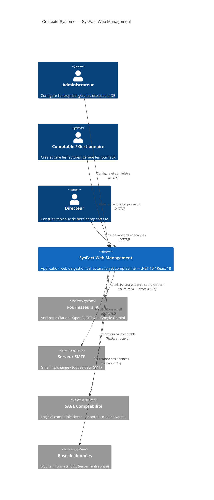
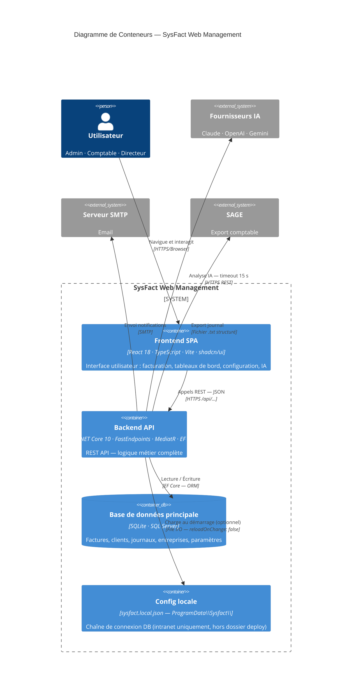

### 2.1 Niveau 1 — Contexte Système

```mermaid
C4Context
    title Contexte Système — SysFact Web Management

    Person(admin, "Administrateur", "Configure l'entreprise, gère les droits et la DB")
    Person(comptable, "Comptable / Gestionnaire", "Crée et gère les factures, génère les journaux")
    Person(directeur, "Directeur", "Consulte tableaux de bord et rapports IA")

    System(sysfact, "SysFact Web Management", "Application web de gestion de facturation et comptabilité — .NET 10 / React 18")

    System_Ext(ai_provider, "Fournisseurs IA", "Anthropic Claude · OpenAI GPT-4o · Google Gemini")
    System_Ext(smtp, "Serveur SMTP", "Gmail · Exchange · tout serveur SMTP")
    System_Ext(sage, "SAGE Comptabilité", "Logiciel comptable tiers — import journal de ventes")
    System_Ext(db, "Base de données", "SQLite (intranet) · SQL Server (entreprise)")

    Rel(admin, sysfact, "Configure et administre", "HTTPS")
    Rel(comptable, sysfact, "Gère les factures et journaux", "HTTPS")
    Rel(directeur, sysfact, "Consulte rapports et analyses", "HTTPS")
    Rel(sysfact, ai_provider, "Appels IA (analyse, prédiction, rapport)", "HTTPS REST — timeout 15 s")
    Rel(sysfact, smtp, "Notifications email", "SMTP/TLS")
    Rel(sysfact, sage, "Export journal comptable", "Fichier structuré")
    Rel(sysfact, db, "Persistance des données", "EF Core / TCP")
```

### 2.2 Niveau 2 — Conteneurs

```mermaid
C4Container
    title Diagramme de Conteneurs — SysFact Web Management

    Person(user, "Utilisateur", "Admin · Comptable · Directeur")

    System_Boundary(sysfact, "SysFact Web Management") {
        Container(spa, "Frontend SPA", "React 18 · TypeScript · Vite · shadcn/ui", "Interface utilisateur : facturation, tableaux de bord, configuration, IA")
        Container(api, "Backend API", "ASP.NET Core 10 · FastEndpoints · MediatR · EF Core", "REST API — logique métier complète")
        ContainerDb(db_main, "Base de données principale", "SQLite · SQL Server", "Factures, clients, journaux, entreprises, paramètres")
        Container(local_cfg, "Config locale", "sysfact.local.json — ProgramData\\Sysfact\\", "Chaîne de connexion DB (intranet uniquement, hors dossier deploy)")
    }

    System_Ext(ai_provider, "Fournisseurs IA", "Claude · OpenAI · Gemini")
    System_Ext(smtp_ext, "Serveur SMTP", "Email")
    System_Ext(sage_ext, "SAGE", "Export comptable")

    Rel(user, spa, "Navigue et interagit", "HTTPS/Browser")
    Rel(spa, api, "Appels REST — JSON", "HTTPS /api/...")
    Rel(api, db_main, "Lecture / Écriture", "EF Core — ORM")
    Rel(api, local_cfg, "Charge au démarrage (optionnel)", "File I/O — reloadOnChange: false")
    Rel(api, ai_provider, "Analyse IA — timeout 15 s", "HTTPS REST")
    Rel(api, smtp_ext, "Envoi notifications", "SMTP")
    Rel(api, sage_ext, "Export journal", "Fichier .txt structuré")
```

---