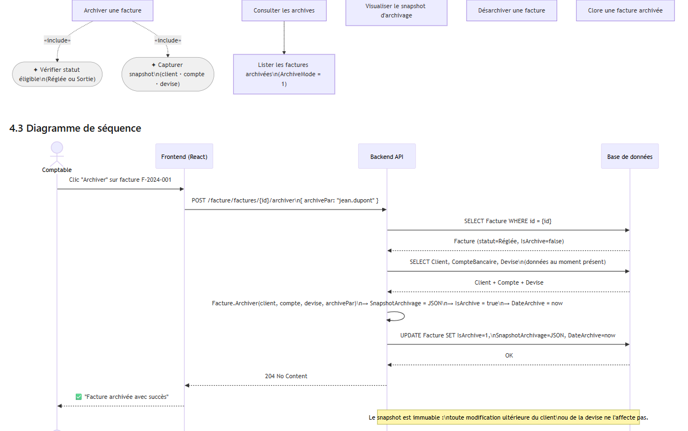

### 4.1 Présentation & Gains

**Objectif** : Figer l'état d'une facture réglée en capturant un snapshot immuable des données tiers au moment de l'archivage (client, compte bancaire, devise). Garantit que toute réimpression ou audit futur reflète la réalité au moment de la transaction, même si le client ou la devise a évolué depuis.

**Gain vs Legacy** : Le legacy archivait les factures sans capturer les données liées. Un changement d'adresse client ou de taux de devise rendait les anciennes factures incorrectes à la réimpression.

### 4.2 Cas d'utilisation

### 4.3 Diagramme de séquence

### 4.4 Scénarios de test

#### ✅ SC-ARC-01 — Archivage nominal d'une facture réglée

| | |
| --- | --- |
| **Pré-condition** | Facture F-001 existe, `StatutId=14004` (Sortie), `DatePaiement ≠ null`, `IsArchive=false` |
| **Acteur** | Comptable |
| **Étapes** | 1. `POST /facture/factures/{id}/archiver` avec `{ archivePar: "test" }` |
| **Résultats attendus** | HTTP 204 · `IsArchive=true` · `DateArchive` renseignée · `SnapshotArchivage` = JSON valide avec `client.nomClient`, `devise.taux`, `compte.numeroCom` |
| **Vérification DB** | `SELECT IsArchive, SnapshotArchivage FROM sysfact.Factures WHERE Id = {id}` → snapshot non null |

#### ❌ SC-ARC-02 — Archivage d'une facture déjà archivée

| | |
| --- | --- |
| **Pré-condition** | Facture F-001, `IsArchive=true` |
| **Étapes** | `POST /facture/factures/{id}/archiver` |
| **Résultats attendus** | HTTP 400 · message `"Facture déjà archivée."` |

#### ✅ SC-ARC-03 — Consultation de la liste des archives

| | |
| --- | --- |
| **Étapes** | `GET /facture/factures?ArchiveMode=1&companyId={id}&Page=1&PerPage=20` |
| **Résultats attendus** | Seules les factures avec `IsArchive=true` sont retournées |

#### ✅ SC-ARC-04 — Désarchivage et conservation du snapshot

| | |
| --- | --- |
| **Pré-condition** | Facture archivée |
| **Étapes** | Appel Désarchiver (via endpoint ou commande) |
| **Résultats attendus** | `IsArchive=false` · `SnapshotArchivage` **toujours présent** (historique) |

#### ✅ SC-ARC-05 — Clôture après archivage

| | |
| --- | --- |
| **Pré-condition** | Facture archivée (`IsArchive=true`) |
| **Étapes** | `POST /facture/factures/{id}/clore` |
| **Résultats attendus** | HTTP 204 · `DateCloture ≠ null` |

---