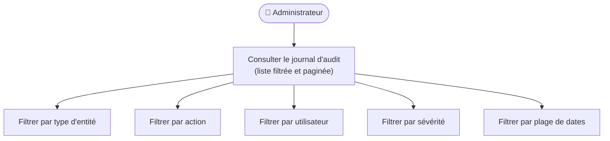
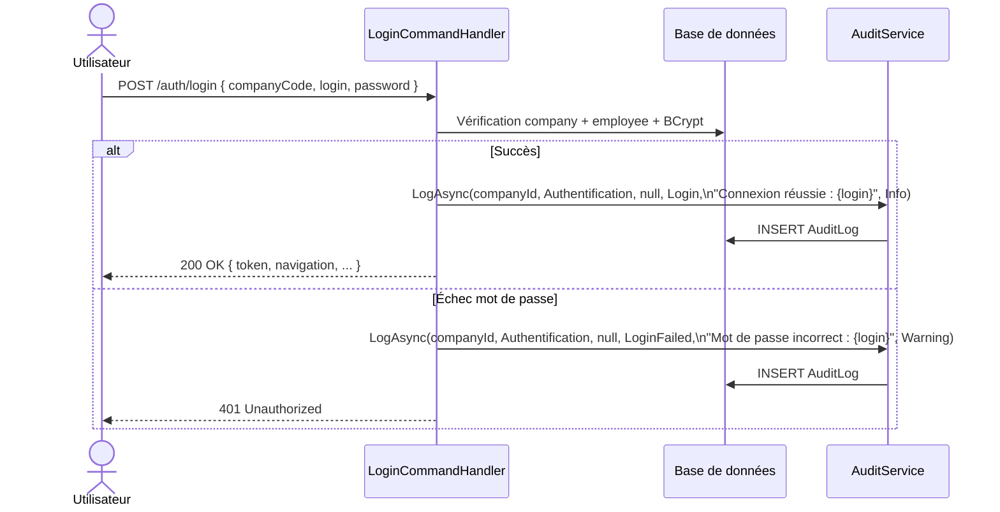

### 10.1 Présentation & Gains

**Objectif** : Journaliser toutes les actions sensibles dans une table `AuditLog` horodatée, immuable et consultable par l'administrateur.

| Champ | Description |
| --- | --- |
| `CompanyId` | Isolation par entreprise |
| `UserName` | Login de l'utilisateur ayant déclenché l'action |
| `UserIp` | Adresse IP de la requête |
| `EntityType` | `Facture` · `Devis` · `JournalVente` · `Utilisateur` · `Authentification` · `Article` · `Inventaire` |
| `EntityId` | Identifiant de l'objet concerné (nullable) |
| `Action` | `Create` · `Update` · `Delete` · `Archive` · `Restore` · `Validate` · `Export` · `Login` · `LoginFailed` |
| `Summary` | Texte libre décrivant l'action |
| `Severity` | `Info` · `Warning` · `Critical` |
| `DateAction` | Horodatage UTC |

**Index DB** : `(CompanyId, DateAction)`, `(CompanyId, EntityType)`, `(CompanyId, UserName)`.

### 10.2 Cas d'utilisation



### 10.3 Diagramme de séquence — Login audité



### 10.4 Comment auditer une action (exemple)

```csharp
await audit.LogAsync(
    companyId  : CompanyId.From(currentUser.CompanyId!.Value),
    entityType : AuditEntityType.Facture,
    entityId   : factureId.ToString(),
    action     : AuditAction.Archive,
    summary    : $"Facture {numero} archivée par {currentUser.Login}",
    severity   : AuditSeverity.Info,
    ct         : ct);
```

### 10.5 Scénarios de test

| Scénario | Étapes | Résultats attendus |
| --- | --- | --- |
| SC-AUD-01 ✅ | `GET /admin/audit/logs?page=1&perPage=20` | HTTP 200 · liste paginée · chaque entrée a `userName`, `dateAction`, `action`, `severity` |
| SC-AUD-02 ✅ | `GET /admin/audit/logs?severity=Warning` | Seules les entrées `severity=Warning` retournées |
| SC-AUD-03 ✅ | `GET /admin/audit/logs?dateDebut=2025-01-01&dateFin=2025-01-31` | Entrées dans la plage uniquement |
| SC-AUD-04 ✅ | `POST /auth/login` avec identifiants valides | Entrée `action=Login`, `severity=Info`, `entityType=Authentification` créée |
| SC-AUD-05 ✅ | `POST /auth/login` avec mauvais mot de passe | Entrée `action=LoginFailed`, `severity=Warning` créée |

---