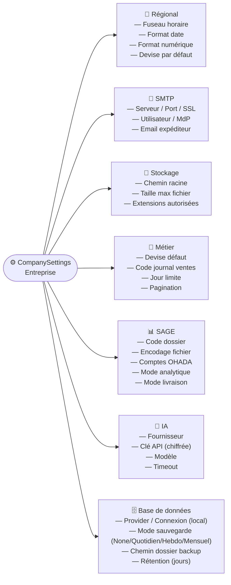
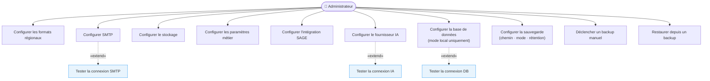
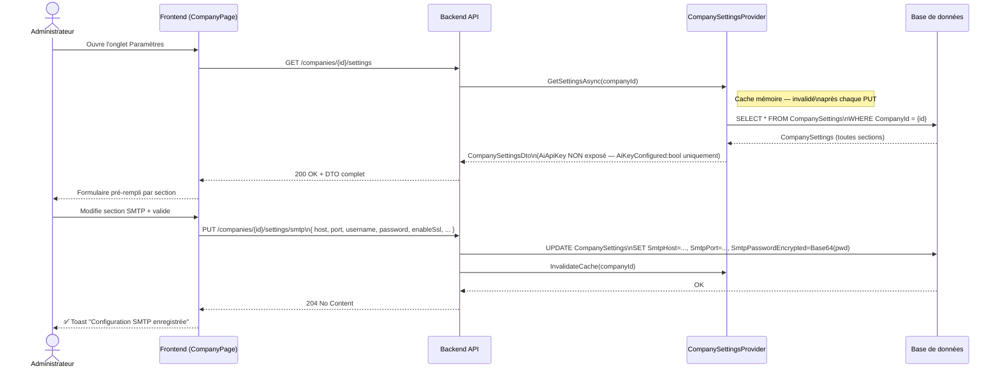

### 7.1 Vue d'ensemble des sections

### 7.2 Cas d'utilisation globaux

### 7.3 Diagramme de séquence — Chargement et mise à jour

### 7.4 Scénarios de test par section

#### 🌍 Section Formats Régionaux

| Scénario | Étapes | Résultats attendus |
|----------|--------|-------------------|
| SC-CFG-01 ✅ | `PUT /companies/{id}/settings/formats` `{ timeZone: "Africa/Douala", dateFormat: "dd/MM/yyyy", numberFormat: "fr-FR", defaultCurrency: "XAF" }` | HTTP 204 · Affichage des dates et montants mis à jour |
| SC-CFG-02 ❌ | `timeZone: ""` (vide) | HTTP 400 — validation |

#### 📧 Section SMTP

| Scénario | Étapes | Résultats attendus |
|----------|--------|-------------------|
| SC-CFG-03 ✅ | `PUT /companies/{id}/settings/smtp` `{ useCustomSmtp: true, host: "smtp.gmail.com", port: 587, enableSsl: true, ... }` | HTTP 204 · Mot de passe stocké en Base64 |
| SC-CFG-04 ✅ | Modification sans passer le mot de passe (`smtpPasswordClear: null`) | HTTP 204 · Ancien mot de passe **conservé** (pas écrasé) |
| SC-CFG-05 ✅ | `useCustomSmtp: false` | HTTP 204 · Serveur SMTP par défaut utilisé |

#### 💾 Section Stockage

| Scénario | Étapes | Résultats attendus |
|----------|--------|-------------------|
| SC-CFG-06 ✅ | `PUT /companies/{id}/settings/storage` `{ storageRootPath: "C:\\data\\sysfact", maxFileSizeMb: 10, allowedExtensions: ".pdf,.jpg" }` | HTTP 204 |
| SC-CFG-07 ❌ | `maxFileSizeMb: 0` | HTTP 400 |

#### 🤖 Section IA (cf. aussi SC-IA-*)

| Scénario | Étapes | Résultats attendus |
|----------|--------|-------------------|
| SC-CFG-08 ✅ | `PUT /companies/{id}/settings/ai` `{ aiEnabled: true, aiProvider: "claude", aiApiKey: "sk-ant-...", aiTimeoutSeconds: 15 }` | HTTP 204 · `AiKeyConfigured=true` au prochain GET · clé non exposée |
| SC-CFG-09 ✅ | Re-PUT sans `aiApiKey` (null) | HTTP 204 · Ancienne clé conservée |
| SC-CFG-10 ❌ | `aiProvider: "unknown"` | HTTP 400 — `"AiProvider doit être 'claude', 'openai' ou 'gemini'"` |
| SC-CFG-11 ❌ | `aiTimeoutSeconds: 120` | HTTP 400 — hors plage [5, 60] |

#### 🗄️ Section Base de données (mode local uniquement)

| Scénario | Étapes | Résultats attendus |
|----------|--------|-------------------|
| SC-CFG-12 ✅ | `POST /admin/local-config/database/test` `{ dbProvider: "sqlite", connectionString: "Data Source=C:\\data\\test.db" }` | HTTP 200 `{ success: true, message: "Connexion réussie." }` |
| SC-CFG-13 ❌ | Test connexion SQL Server — serveur inexistant | HTTP 408 Timeout ou HTTP 400 avec message d'erreur SQL |
| SC-CFG-14 ✅ | `PUT /admin/local-config/database` `{ dbProvider: "sqlite", connectionString: "Data Source=C:\\data\\prod.db" }` | HTTP 200 `{ restartRequired: true }` · Fichier `sysfact.local.json` créé dans `%ProgramData%\Sysfact\` |
| SC-CFG-15 ✅ | Appel après `DEPLOYMENT_MODE=saas` | HTTP 403 — endpoint désactivé |
| SC-CFG-16 ✅ | `GET /admin/deployment-info` | HTTP 200 `{ deploymentMode: "local", dbProvider: "sqlite", connectionStringMasked: "Data Source=C:\\...db", localConfigExists: false }` |

#### 📊 Section SAGE

| Scénario | Étapes | Résultats attendus |
|----------|--------|-------------------|
| SC-CFG-17 ✅ | `PUT /companies/{id}/settings/sage` `{ sageDossierCode: "ENT001", sageFileEncoding: "ISO-8859-1", sageJvModeAnalytique: "prod", sageLivraisonMode: "download" }` | HTTP 204 |
| SC-CFG-18 ✅ | Export journal SAGE avec les settings configurés | Fichier généré avec l'encodage `ISO-8859-1` et le code dossier `ENT001` |

---