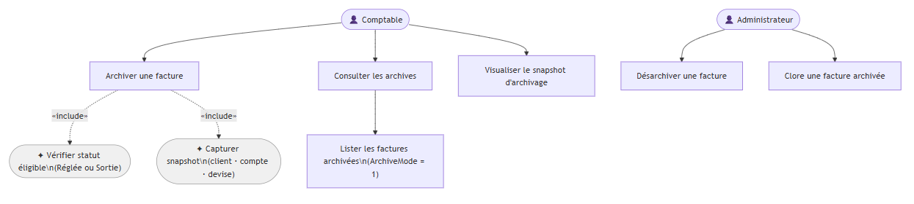

> **Légende des états** :  
> `StatutId 14003` = Validée · `StatutId 14004` = Sortie  
> `IsArchive = true` = Archivée (flag orthogonal au statut)  
> `DateCloture ≠ null` = Clôturée (flag sur Archivée)

### Résumé des transitions par endpoint

| Endpoint | Transition | Batch |
|----------|-----------|-------|
| `POST /facture/factures` | `[*] → Créée` | Non |
| `PUT /facture/statuts/{id}/statut` | `Créée → Validée (14003)` | Non |
| `PUT /facture/factures/sortie` | `Validée → Sortie (14004)` | Oui |
| `PUT /facture/factures/annuler-sortie` | `Sortie → Validée (14003)` | Oui |
| `PUT /facture/factures/paiement` | `Sortie → Réglée` | Oui |
| `PUT /facture/factures/annuler-paiement` | `Réglée → Sortie` | Oui |
| `POST /facture/factures/{id}/archiver` | `Réglée/Sortie → Archivée` | Non |
| `POST /facture/factures/{id}/clore` | `Archivée → Clôturée` | Non |

---