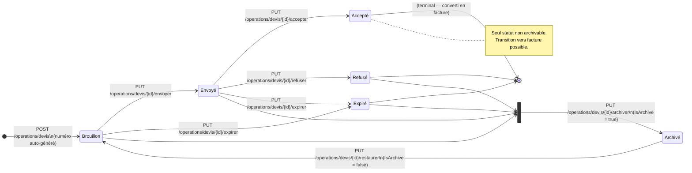
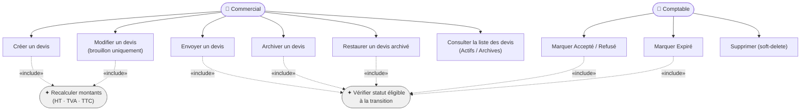
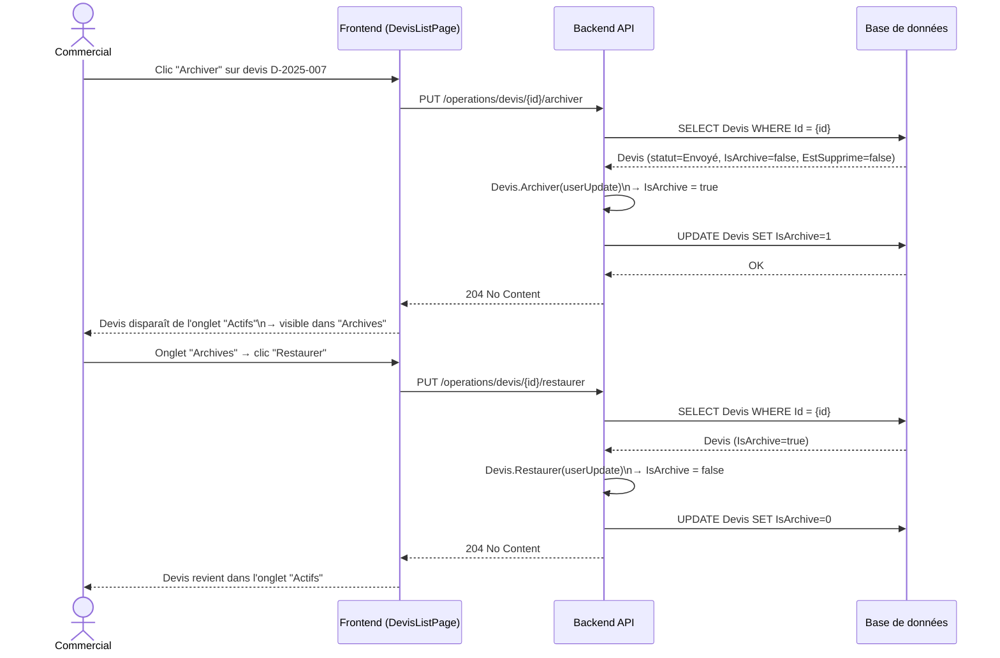

### 8.1 Présentation & Gains

**Objectif** : Permettre la création, le suivi, et l'archivage de devis (offres commerciales) indépendamment des factures. Un devis suit un cycle de vie complet de Brouillon jusqu'à Accepté/Refusé/Expiré, et peut être archivé pour désencombrer la liste active sans suppression.

| Gain | Détail |
| --- | --- |
| Cycle de vie traçable | 6 statuts distincts avec transitions contrôlées — aucune transition invalide possible |
| Archivage non destructif | Masquage des devis anciens sans perte de données — restaurable à tout moment |
| Conversion vers facture | Un devis Accepté peut être converti en facture (lien traçable) |
| Séparation Brouillon / Actifs / Archives | Trois vues distinctes dans l'interface — liste propre, navigation rapide |

### 8.2 Cycle de vie des Devis

> **Statuts** : `15001` Brouillon · `15002` Envoyé · `15003` Accepté · `15004` Refusé · `15005` Expiré  
> `IsArchive = true` = Archivé (flag orthogonal au statut, sur tout statut non-supprimé)

### 8.3 Cas d'utilisation

### 8.4 Diagramme de séquence — Archivage / Restauration

### 8.5 Scénarios de test

#### ✅ SC-DEV-01 — Création et cycle de vie nominal

| | |
| --- | --- |
| **Étapes** | 1. `POST /operations/devis` → statut=Brouillon (15001) 2. `PUT /{id}/envoyer` → Envoyé (15002) 3. `PUT /{id}/accepter` → Accepté (15003) |
| **Résultats attendus** | HTTP 201 puis 204×2 · Chaque statut enregistré en DB · `DateModification` mis à jour |

#### ✅ SC-DEV-02 — Archivage et filtrage

| | |
| --- | --- |
| **Pré-condition** | Devis D-001, statut=Envoyé, `IsArchive=false` |
| **Étapes** | 1. `PUT /operations/devis/{id}/archiver` 2. `GET /operations/devis?isArchive=false` 3. `GET /operations/devis?isArchive=true` |
| **Résultats attendus** | Étape 1 : HTTP 204 · Étape 2 : D-001 absent · Étape 3 : D-001 présent |

#### ❌ SC-DEV-03 — Archivage d'un devis Accepté

| | |
| --- | --- |
| **Pré-condition** | Devis statut=Accepté (15003) |
| **Étapes** | `PUT /operations/devis/{id}/archiver` |
| **Résultats attendus** | HTTP 400 — `"Un devis accepté ne peut pas être archivé."` |

#### ✅ SC-DEV-04 — Idempotence archivage

| | |
| --- | --- |
| **Étapes** | Appeler `archiver` deux fois sur le même devis |
| **Résultats attendus** | HTTP 204 les deux fois — pas d'erreur |

#### ❌ SC-DEV-05 — Transition invalide

| | |
| --- | --- |
| **Pré-condition** | Devis statut=Brouillon (15001) |
| **Étapes** | `PUT /operations/devis/{id}/accepter` (Brouillon → Accepté sans passer par Envoyé) |
| **Résultats attendus** | HTTP 400 — transition non autorisée |

---