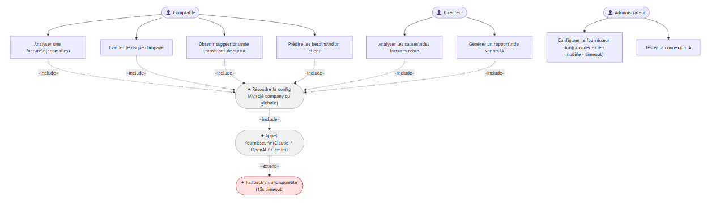
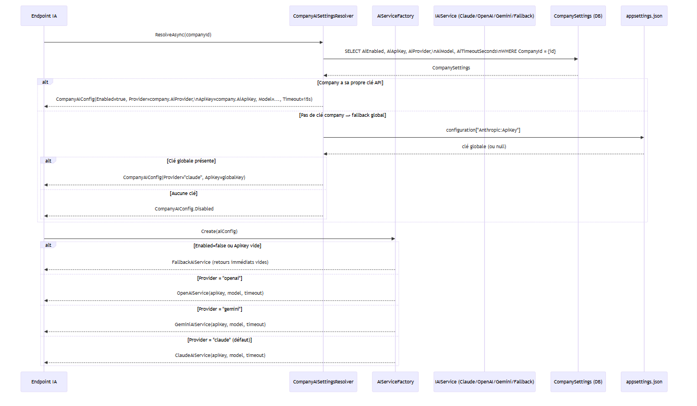
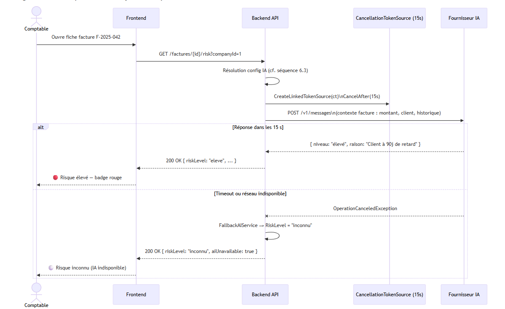

### 6.1 Présentation & Gains

**Objectif** : Fournir des capacités d'analyse et de prédiction sur les données de facturation, sans bloquer l'application en cas d'indisponibilité réseau. Chaque entreprise peut configurer son propre fournisseur IA.

| Endpoint | Fonctionnalité | Utilisateur |
|----------|---------------|-------------|
| `GET /factures/{id}/analyze` | Détection d'anomalies sur une facture | Comptable |
| `GET /factures/{id}/risk` | Prédiction risque d'impayé (faible/modéré/élevé/critique) | Comptable |
| `POST /factures/ai/status-suggestions` | Suggestions de transitions de statut sur les factures actives | Comptable |
| `GET /factures/ai/rebus-analysis` | Analyse des causes racines des factures en rebus | Directeur |
| `GET /clients/{id}/ai/product-suggestions` | Prédictions de besoins produit pour un client | Commercial |
| `GET /ai/sales-summary` | Rapport de ventes IA sur une période | Directeur |
| `POST /ai/ask` | Question libre sur les données | Tout utilisateur |

### 6.2 Cas d'utilisation

### 6.3 Diagramme de séquence — Résolution multi-fournisseur

### 6.4 Diagramme de séquence — Analyse de risque

### 6.5 Scénarios de test

#### ✅ SC-IA-01 — Analyse de facture nominale (IA active)

| | |
| --- | --- |
| **Pré-condition** | `AiEnabled=true`, clé API valide, connexion internet disponible |
| **Étapes** | `GET /factures/{id}/analyze?companyId=1` |
| **Résultats attendus** | HTTP 200 · `anomaliesDetected ≥ 0` · `confidence > 0` · `suggestions` non null |

#### ✅ SC-IA-02 — Fallback sans internet (timeout 15s)

| | |
| --- | --- |
| **Pré-condition** | Coupure réseau simulée (désactiver l'interface réseau) |
| **Étapes** | `GET /factures/{id}/analyze?companyId=1` |
| **Résultats attendus** | Réponse dans < 16 s · HTTP 200 · `anomaliesDetected=0` · `warnings=[]` · L'application reste utilisable |

#### ✅ SC-IA-03 — Fallback IA désactivée (AiEnabled=false)

| | |
| --- | --- |
| **Pré-condition** | `AiEnabled=false` dans CompanySettings |
| **Résultats attendus** | HTTP 200 immédiat · réponse vide/minimale · aucun appel au fournisseur externe |

#### ✅ SC-IA-04 — Analyse causes rebus

| | |
| --- | --- |
| **Pré-condition** | ≥ 3 factures en statut Rebus pour la company |
| **Étapes** | `GET /factures/ai/rebus-analysis?companyId=1` |
| **Résultats attendus** | HTTP 200 · `mainCauses` non vide · `globalInsight` (texte) · `preventionActions` non vide · `totalAnalyzed > 0` |

#### ✅ SC-IA-05 — Changement de fournisseur (OpenAI → Claude)

| | |
| --- | --- |
| **Pré-condition** | AiProvider="openai", clé OpenAI valide |
| **Étapes** | 1. `PUT /companies/{id}/settings/ai` avec `{ aiProvider: "claude", aiApiKey: "sk-ant-..." }` 2. `GET /ai/sales-summary?companyId=1` |
| **Résultats attendus** | Le résumé est généré par Claude · aucune erreur de provider |

#### ✅ SC-IA-06 — Suggestions de statut

| | |
| --- | --- |
| **Étapes** | `POST /factures/ai/status-suggestions` `{ companyId: 1 }` |
| **Résultats attendus** | HTTP 200 · `toCloturer`, `toRebus`, `toSortie` listes (peuvent être vides) · `globalAdvice` texte |

---