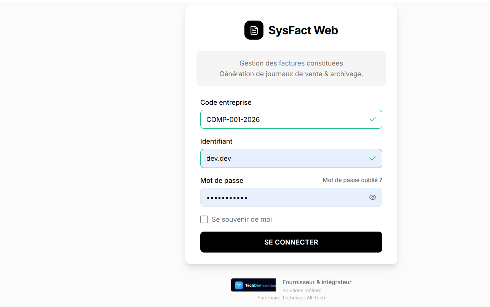
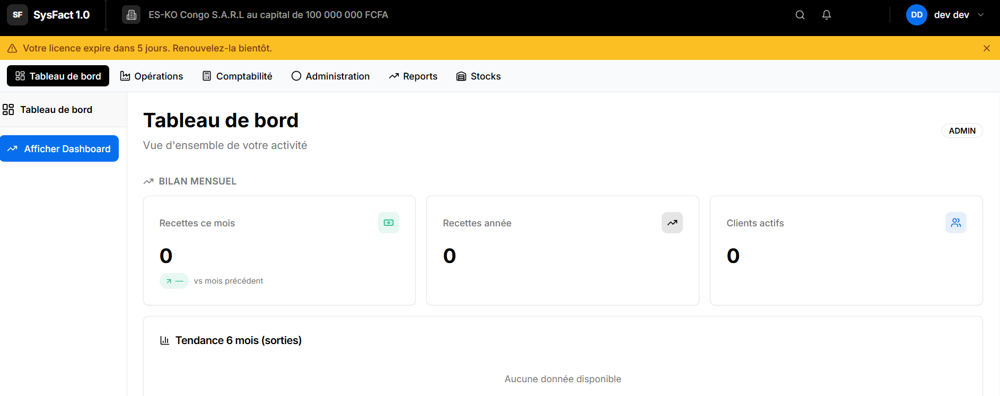

## Présentation générale

**Au départ :** Gestion de la facturation sur produits alimentaires.

**Aujourd'hui**, le système couvre :

| Domaine | Ce qu'il gère |
| --- | --- |
| **Facturation** | Création, validation, sortie, paiement, archivage, clôture — cycle complet |
| **Devis** | Cycle commercial complet (Brouillon → Envoyé → Accepté / Refusé / Expiré), archivage |
| **Stocks** | Catalogue articles, mouvements manuels Entrée / Sortie, inventaires physiques avec régularisation automatique |
| **Comptabilité** | Journal de ventes, génération automatique des écritures, export SAGE |
| **Intelligence Artificielle** | Analyse de risque d'impayé, détection d'anomalies, suggestions de statut, rapport de ventes |
| **Configuration Entreprise** | SMTP, stockage, formats régionaux, intégration SAGE, fournisseur IA, sauvegarde BD |
| **Sécurité & RH** | Employés, profils, permissions, licences multi-tenant |
| **Audit & Traçabilité** | Journal d'audit complet — toutes les actions sensibles horodatées, filtrables, par company |
| **Module Proprietaires** | Gestion exclusive Owner — licences clients, génération de clés, modules système |
| **Sauvegarde BD** | Backup/restore SQL Server on-premise — manuel, planifié, avec rétention configurable |

### Qualification du produit Sysfact Web 1.0

> **Système de gestion commerciale et opérationnelle intégré** couvrant le cycle commercial complet (devis → facture → comptabilité), la gestion des stocks physiques, et le pilotage par l'IA.

| Axe | Positionnement |
| --- | --- |
| **Catégorie** | ERP PME / Gestion commerciale — même famille que Sage 50, Cegid, Odoo (version allégée) |
| **Différenciateur** | IA intégrée multi-provider (Claude · OpenAI · Gemini) + architecture multi-tenant SaaS-ready |
| **Cible** | PME africaines — devise XAF, connectivité variable, intégration SAGE existante |

La transition de *logiciel de facturation* vers *ERP PME* est franchie dès que les quatre piliers sont présents : **facturation + devis + stocks + comptabilité** — SysFact les couvre tous.

---

## Sommaire

- [Gains vs Système Legacy](./gains-legacy)
- [Architecture C4](./architecture)
- [Cycle de vie de la Facture](./cycle-facture)
- [Archivage des Factures](./archivage)
- [Journal de Vente](./journal-vente)
- [Intelligence Artificielle](./intelligence-artificielle)
- [Configuration Entreprise (CompanySettings)](./configuration-entreprise)
- [Devis (Cycle de vie & Archivage)](./devis)
- [Module Stocks](./stocks)
- [Audit Log & Traçabilité](./audit-log)
- [Module Proprietaires (Owner)](./module-proprietaires)
- [Sauvegarde et Restauration BD](./sauvegarde-restauration)
- [Annexe — Résumé des endpoints testés](./annexe-endpoints)
