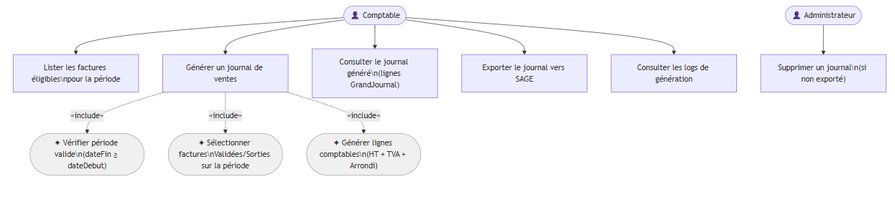
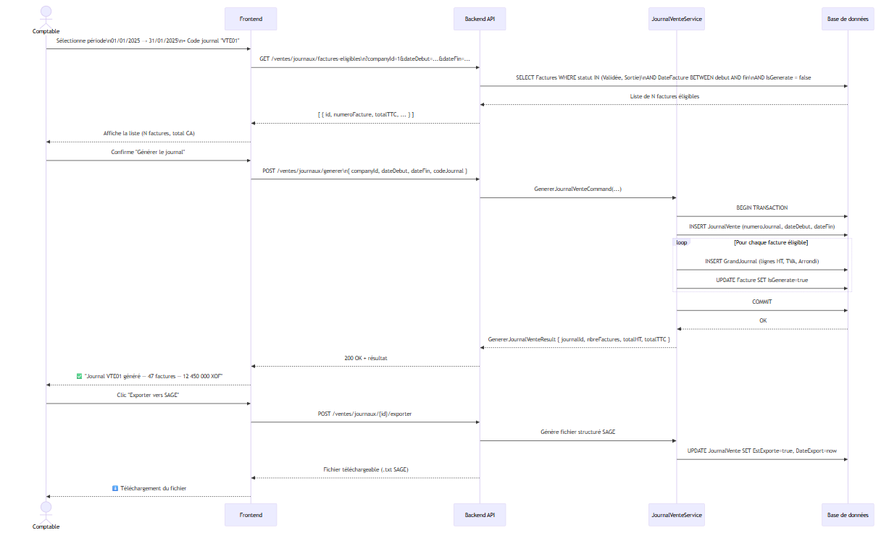

### 5.1 Présentation & Gains

**Objectif** : Agréger automatiquement les factures éligibles d'une période comptable en un journal de ventes structuré, exportable vers SAGE. Chaque génération produit des lignes comptables (`GrandJournal`) couvrant HT, TVA et arrondi.

**Gain vs Legacy** : Génération manuelle dans SAGE → 2-3h/mois. Avec SysFact : `POST /ventes/journaux/generer` en < 5 secondes. Traçabilité complète via `LogComptabilite`.

### 5.2 Cas d'utilisation

### 5.3 Diagramme de séquence

### 5.4 Scénarios de test

#### ✅ SC-JRN-01 — Génération nominale

| | |
| --- | --- |
| **Pré-condition** | 5 factures avec `StatutId=14003` (Validée), `DateFacture` dans janvier 2025, `IsGenerate=false` |
| **Étapes** | `POST /ventes/journaux/generer` `{ companyId: 1, dateDebut: "2025-01-01", dateFin: "2025-01-31", codeJournal: "VTE01" }` |
| **Résultats attendus** | HTTP 200 · `nbreFactures=5` · Journal inséré en DB · `IsGenerate=true` sur les 5 factures · Lignes `GrandJournal` créées (HT + TVA + éventuellement arrondi) |

#### ❌ SC-JRN-02 — Période invalide

| | |
| --- | --- |
| **Étapes** | `dateFin < dateDebut` |
| **Résultats attendus** | HTTP 400 — validation FluentValidation |

#### ✅ SC-JRN-03 — Aucune facture éligible

| | |
| --- | --- |
| **Pré-condition** | Aucune facture sur la période, ou toutes déjà générées (`IsGenerate=true`) |
| **Résultats attendus** | HTTP 200 · `nbreFactures=0` · Journal créé mais vide |

#### ✅ SC-JRN-04 — Export SAGE

| | |
| --- | --- |
| **Pré-condition** | Journal `id=1` généré, `EstExporte=false` |
| **Étapes** | `POST /ventes/journaux/1/exporter` |
| **Résultats attendus** | HTTP 200 + fichier binaire · `EstExporte=true` · `DateExport` renseignée en DB |

#### ✅ SC-JRN-05 — Consultation des logs

| | |
| --- | --- |
| **Étapes** | `GET /ventes/journaux/{id}/logs` |
| **Résultats attendus** | Liste des événements de génération (création, lignes, export) avec horodatages |

---