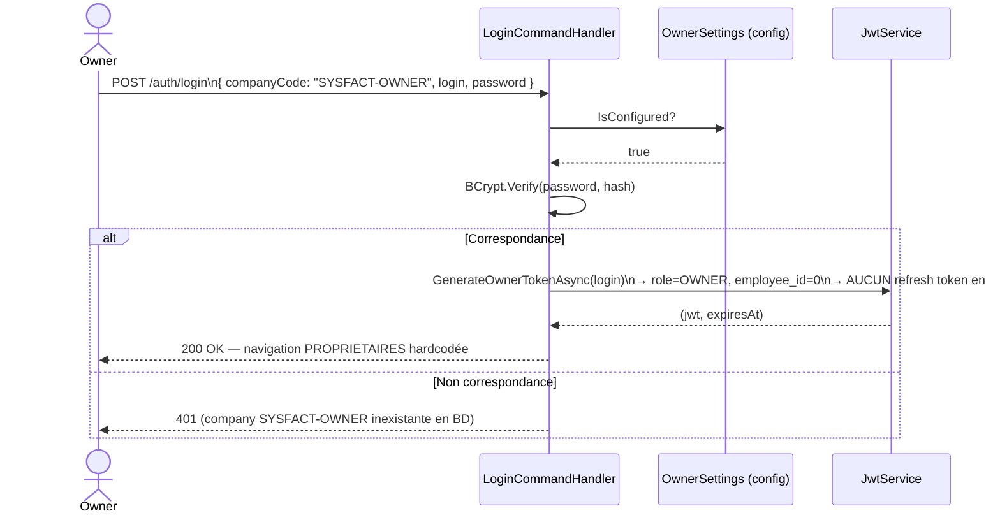

### 11.1 Présentation

**Objectif** : Espace exclusif au compte `OWNER` (propriétaire de la plateforme) pour gérer les licences clients, générer des clés d'activation et consulter les référentiels système.

> **Sécurité clé** : le compte OWNER est **hardcodé dans `appsettings.json`** — aucune ligne en base de données. Un DBA ayant accès à la BD ne peut ni modifier ses droits ni usurper son identité. Le JWT généré porte `role=OWNER`, vérifié par `Roles("OWNER")` sur tous les endpoints `/owner/*`.

```json
"Owner": {
  "EnterpriseCode": "SYSFACT-OWNER",
  "Login": "owner@sysfact.com",
  "PasswordHash": "$2a$12$..."
}
SysfactOwner2025!
```

### 11.2 Flux d'authentification Owner (sans BD)



### 11.3 Fonctionnalités

#### Licences clients

| Endpoint | Rôle |
| --- | --- |
| `GET /owner/activation-keys` | Liste toutes les clés avec filtres (statut, plan, company code) + pagination |
| `POST /owner/activation-keys` | Génère une nouvelle clé d'activation |

**Plans et modules par défaut** :

| Plan | Modules inclus |
| --- | --- |
| `Trial` | `TABLEAU_DE_BORD`, `OPERATIONS` |
| `Essential` | + `ADMINISTRATION`, `PROPRIETAIRES` |
| `Professional` / `Enterprise` | Tous les modules |

#### Référentiels système (lecture seule)

| Endpoint | Rôle |
| --- | --- |
| `GET /system-modules` | Liste les `SystemModule` paginés |
| `GET /system-modules/{id}/submodules` | Sous-modules d'un module |
| `GET /system-menus` | Liste les `SystemMenu` paginés |

### 11.4 Scénarios de test

| Scénario | Étapes | Résultats attendus |
| --- | --- | --- |
| SC-OWN-01 ✅ | Login avec `companyCode=SYSFACT-OWNER` + bon mot de passe | JWT valide · `profileCode=OWNER` · navigation PROPRIETAIRES · zéro accès BD |
| SC-OWN-02 ❌ | `GET /owner/activation-keys` avec token Admin normal | HTTP 403 |
| SC-OWN-03 ✅ | `POST /owner/activation-keys { planType: "Professional", durationMonths: 12, maxUsers: 20 }` | HTTP 200 · clé générée · `status=Pending` · `expiresAt` dans 12 mois |
| SC-OWN-04 ✅ | `GET /owner/activation-keys?status=Pending` | HTTP 200 · toutes les clés ont `status=Pending` |
| SC-OWN-05 ❌ | Login Owner avec mauvais mot de passe | HTTP 401 |

---