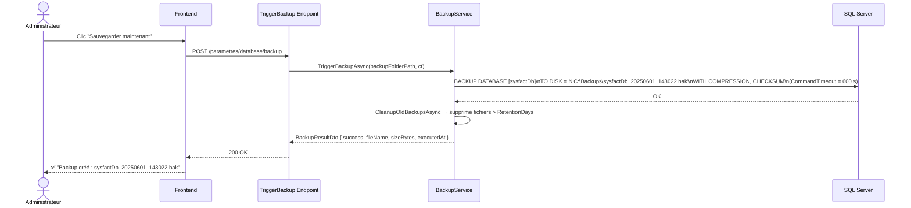
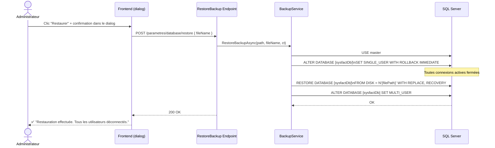

### 12.1 Présentation & Gains

**Objectif** : Permettre à l'administrateur de configurer, déclencher et gérer les sauvegardes SQL Server depuis l'interface web, sans aucun accès au serveur ni à SSMS.

**Périmètre** : On-premise SQL Server. Pour SQLite (dev), copie de fichier `.db`.

| Gain | Détail |
| --- | --- |
| Autonomie totale | Backup et restore depuis l'UI — aucun DBA ni SSMS requis |
| Planification flexible | None / Quotidien / Hebdomadaire / Mensuel — heure configurable |
| Rétention automatique | Suppression des anciens fichiers au-delà du nombre de jours configuré |
| Restore sécurisé | Dialog de confirmation obligatoire avec avertissements clairs |
| Multi-tenant | Chemin et planning configurés par company dans `CompanySettings` |

### 12.2 Configuration (CompanySettings)

| Champ | Type | Défaut | Description |
| --- | --- | --- | --- |
| `AllowDatabaseAccess` | bool | `false` | Active les fonctions BD |
| `BackupMode` | enum | `None` | `None` · `Daily` · `Weekly` · `Monthly` |
| `BackupTime` | TimeSpan | `02:00` | Heure de déclenchement auto |
| `BackupFolderPath` | string? | null | Chemin **côté SQL Server** |
| `BackupRetentionDays` | int | `7` | Jours de conservation |

> ⚠️ Le chemin doit être accessible par le **service Windows SQL Server** (`NT SERVICE\MSSQLSERVER`), pas uniquement par l'application web.

### 12.3 Diagramme de séquence — Backup manuel

### 12.4 Diagramme de séquence — Restauration

### 12.5 Planificateur automatique

Le `BackupSchedulerService` (`IHostedService`) vérifie **toutes les 5 minutes** si un backup est dû :

| Mode | Condition |
| --- | --- |
| `Daily` | Heure ≥ `BackupTime` ET aucun fichier `yyyyMMdd*` dans le dossier aujourd'hui |
| `Weekly` | Lundi ET heure ≥ `BackupTime` ET aucun fichier `yyyyMMdd*` cette semaine |
| `Monthly` | 1er du mois ET heure ≥ `BackupTime` ET aucun fichier `yyyyMM*` ce mois |

### 12.6 Scénarios de test

| Scénario | Étapes | Résultats attendus |
| --- | --- | --- |
| SC-DB-01 ✅ | `PUT /parametres/database/settings { backupMode: 1, backupTime: "02:00", backupFolderPath: "C:\\Backups", backupRetentionDays: 7 }` | HTTP 200 · `CompanySettings` mis à jour |
| SC-DB-02 ✅ | `POST /parametres/database/backup` (chemin valide) | HTTP 200 · `success=true` · fichier `.bak` créé |
| SC-DB-03 ❌ | `POST /parametres/database/backup` (chemin null) | HTTP 400 — "Chemin de sauvegarde non configuré" |
| SC-DB-04 ✅ | `GET /parametres/database/backups` (3 fichiers présents) | HTTP 200 · 3 entrées avec `fileName`, `displaySize`, `createdAt` |
| SC-DB-05 ✅ | `POST /parametres/database/restore { fileName: "sysfactDb_xxx.bak" }` | HTTP 200 · BD restaurée · connexions fermées |
| SC-DB-06 ❌ | `POST /parametres/database/restore { fileName: "inexistant.bak" }` | HTTP 400 — erreur SQL Server |
| SC-DB-07 ✅ | Backup avec 2 fichiers de +8 jours (`RetentionDays=7`) | Backup créé + 2 anciens fichiers supprimés |

---