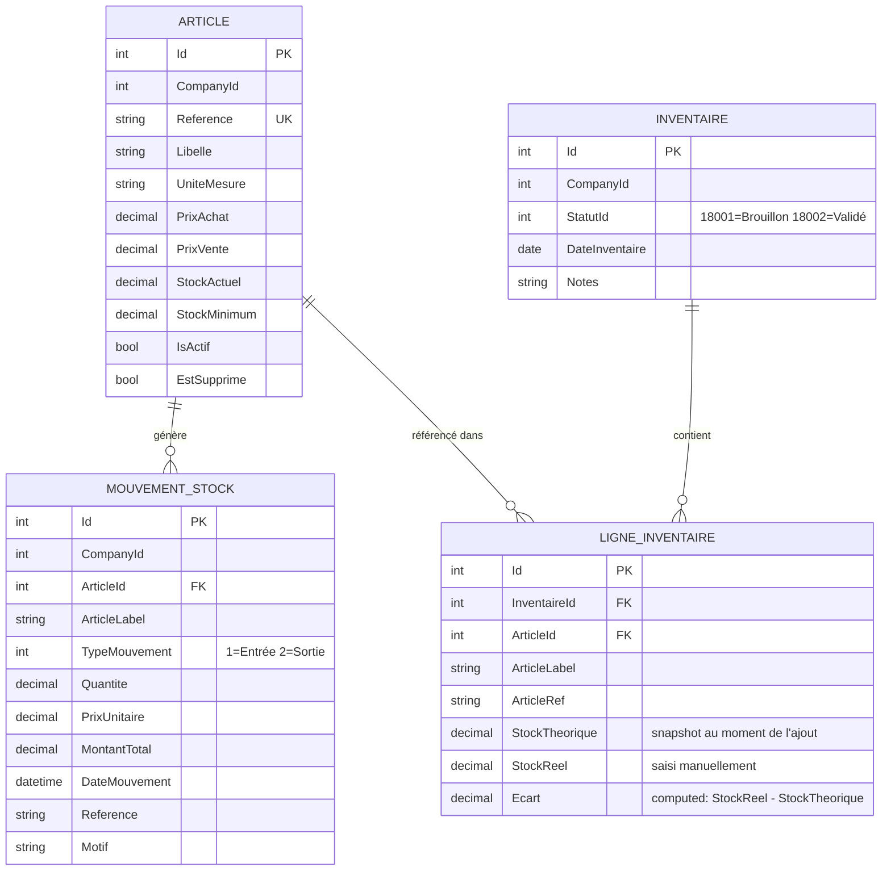
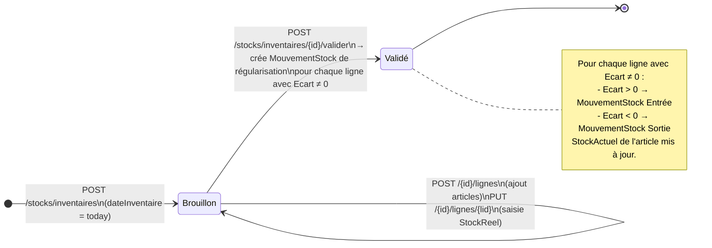
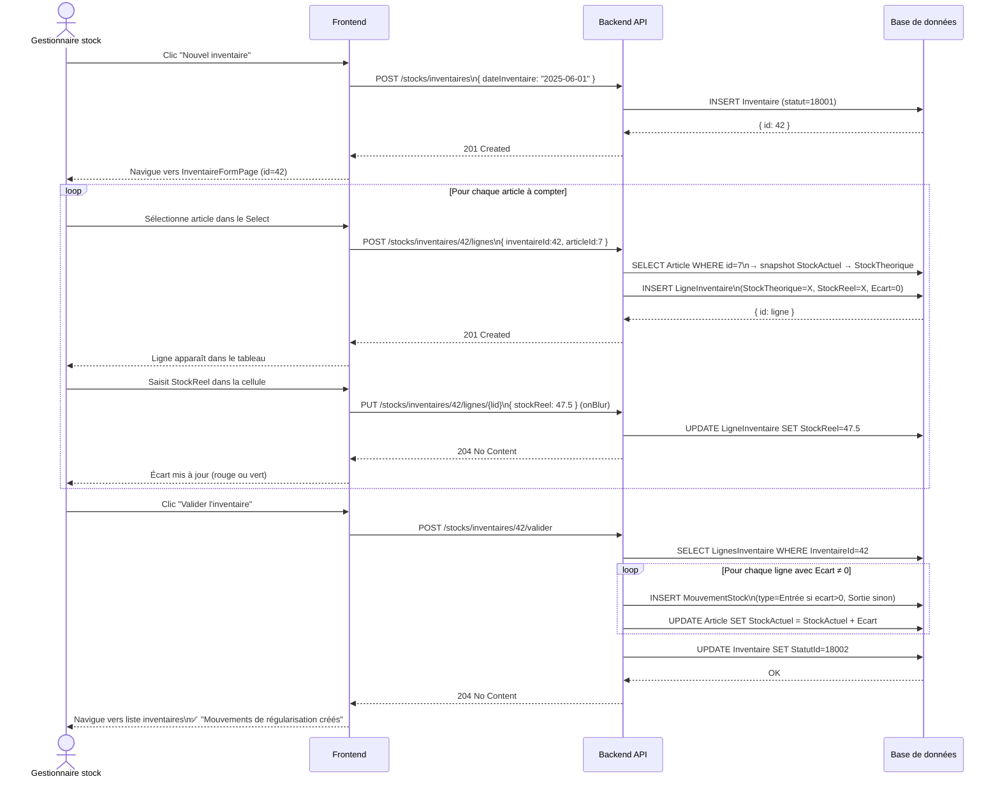
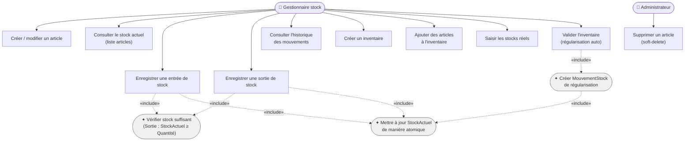

### 9.1 Présentation & Gains

**Objectif** : Gérer un catalogue d'articles physiques (distinct des Produits de facturation), suivre les entrées/sorties manuelles de stock, et réaliser des inventaires périodiques avec régularisation automatique.

| Gain | Détail |
| --- | --- |
| Séparation Articles / Produits | Articles = stock physique géré manuellement. Produits = catalogue facturation. Deux référentiels indépendants. |
| Stock en temps réel | `StockActuel` mis à jour atomiquement à chaque mouvement — lecture instantanée sans agrégation |
| Alerte stock minimum | Indicateur visuel `TrendingDown` quand `StockActuel ≤ StockMinimum` |
| Inventaire avec régularisation | Validation de l'inventaire crée automatiquement les mouvements de régularisation pour chaque écart |
| Traçabilité complète | Tout changement de stock passe par un `MouvementStock` — historique immuable |

### 9.2 Entités du module

### 9.3 Cycle de vie de l'Inventaire

### 9.4 Diagramme de séquence — Inventaire complet

### 9.5 Cas d'utilisation

### 9.6 Scénarios de test

#### ✅ SC-STK-01 — Entrée de stock nominale

| | |
| --- | --- |
| **Pré-condition** | Article A-001 existe, `StockActuel = 10.00` |
| **Étapes** | `POST /stocks/mouvements` `{ articleId: 1, typeMouvement: 1, quantite: 5, prixUnitaire: 100 }` |
| **Résultats attendus** | HTTP 201 · `MontantTotal = 500` · `StockActuel(A-001) = 15.00` |

#### ❌ SC-STK-02 — Sortie stock insuffisant

| | |
| --- | --- |
| **Pré-condition** | Article A-001, `StockActuel = 3.00` |
| **Étapes** | `POST /stocks/mouvements` `{ typeMouvement: 2, quantite: 5 }` |
| **Résultats attendus** | HTTP 400 — `"Stock insuffisant : stock actuel 3, demandé 5"` |

#### ✅ SC-STK-03 — Inventaire avec régularisation

| | |
| --- | --- |
| **Pré-condition** | Article A-001 `StockActuel=10`, Article A-002 `StockActuel=20` |
| **Étapes** | 1. Créer inventaire 2. Ajouter A-001 (StockTheorique snap=10) et A-002 (snap=20) 3. Saisir StockReel=8 pour A-001, StockReel=20 pour A-002 4. Valider |
| **Résultats attendus** | 1 mouvement Sortie créé pour A-001 (quantite=2) · Aucun mouvement pour A-002 · `StockActuel(A-001)=8` · Inventaire statut=18002 |

#### ❌ SC-STK-04 — Valider un inventaire déjà validé

| | |
| --- | --- |
| **Pré-condition** | Inventaire `StatutId=18002` (Validé) |
| **Étapes** | `POST /stocks/inventaires/{id}/valider` |
| **Résultats attendus** | HTTP 400 — `"L'inventaire est déjà validé."` |

#### ✅ SC-STK-05 — Alerte stock minimum

| | |
| --- | --- |
| **Pré-condition** | Article A-001, `StockActuel=5`, `StockMinimum=10` |
| **Étapes** | `GET /stocks/articles?companyId=1` |
| **Résultats attendus** | HTTP 200 · Article retourné avec `stockActuel=5`, `stockMinimum=10` · Frontend affiche indicateur rouge `TrendingDown` |

#### ✅ SC-STK-06 — Article unique par référence dans la company

| | |
| --- | --- |
| **Étapes** | Créer deux articles avec la même `reference` pour le même `companyId` |
| **Résultats attendus** | HTTP 400 sur le second — contrainte d'unicité (CompanyId, Reference) |

---

---